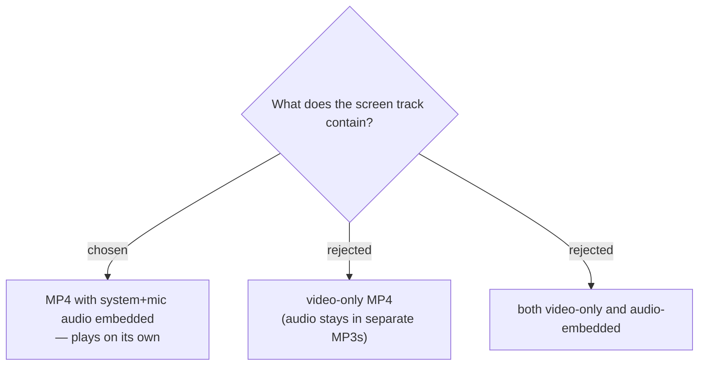

# Screen track is a self-contained MP4 with embedded audio

The `screen` track is an MP4 that embeds the meeting audio (system + mic) so the
file is watchable on its own without the separate MP3 tracks. We rejected
video-only (forces the viewer to juggle a video plus three MP3s) and "both"
(double the encode cost for a file nobody asked for). The existing `system` /
`mic` / `mixed` MP3 tracks are unchanged — the screen track is **additive**, and
its embedded audio is captured independently by the recorder library rather than
muxed from the MP3s, which keeps audio/video in sync within the file.
