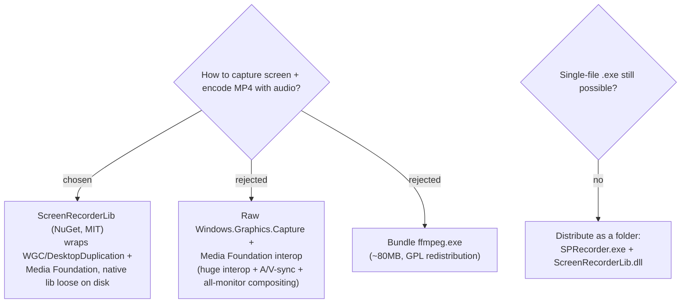

# Use ScreenRecorderLib for screen capture and MP4 encoding (folder distribution)

We use **ScreenRecorderLib** (MIT) for the `screen` track. It wraps
Windows.Graphics.Capture / Desktop Duplication + Media Foundation, captures
system + mic audio, hardware-encodes H.264, writes MP4 directly, composites
multiple displays onto one canvas, and has a built-in mouse-click highlight. Raw
Media Foundation interop was rejected as a large, bug-prone effort (D3D11 +
SinkWriter + A/V sync + per-monitor compositing all hand-written — confirmed by
research: WGC has no whole-virtual-desktop item). Bundling ffmpeg.exe was
rejected for size and GPL redistribution constraints.

**Packaging reality (corrects the original assumption).** Research found
ScreenRecorderLib ships a **mixed-mode C++/CLI assembly** per architecture,
injected via an MSBuild `.targets` `<Reference>`. Consequences, all verified:

- The project must build with an **explicit `Platform` (x64)** — `AnyCPU` is
  rejected by the library's targets.
- A mixed-mode managed assembly **cannot be embedded in a .NET single-file
  bundle** — `PublishSingleFile` / `IncludeNativeLibrariesForSelfExtract` do not
  help. `ScreenRecorderLib.dll` must remain a **loose file on disk**.
- Therefore SPRecorder is distributed as a **folder** (`SPRecorder.exe` +
  `ScreenRecorderLib.dll` + `appsettings.json` + any companion natives), copied
  as-is. This still satisfies the hard requirement — **no installer** — it is
  just no longer a single file. The user accepted this trade-off.
- Runtime prerequisites on the target machine: **Visual C++ Redistributable**
  and **Media Foundation** (present on normal Win10/11; absent on N/KN editions
  without the Media Feature Pack, and on Windows Server without the feature).

README's "copy `SPRecorder.exe` and `appsettings.json` together" instruction is
updated to "copy the published folder." ARM64 is out of scope.
