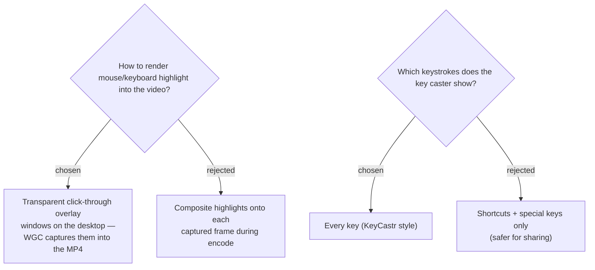

# Input highlight via captured overlay windows; key caster shows all keys

The **input highlight** is drawn as transparent, topmost, click-through overlay
windows on the live desktop. Windows.Graphics.Capture composites the desktop
including these layered windows, so the screen recorder captures the highlights
into the MP4 without per-frame compositing. The **mouse highlight** uses
ScreenRecorderLib's built-in click effect; the **key caster** is custom (no
recorder renders keystrokes) — a bottom-of-screen caption fed by a global
low-level keyboard hook (`WH_KEYBOARD_LL`).

The key caster **shows every key**, KeyCastr-style. We accept the privacy
trade-off: a recorded/shared video can expose typed passwords or sensitive text.
This is documented as a warning in the README and surfaced near the
record-screen toggle. (A pause-the-caster hotkey is an optional enhancement, not
a requirement.) Showing only shortcuts was rejected because the user wants a full
demonstration record.

**Consequence:** the app installs a global low-level keyboard hook only while the
`screen` track is recording with the key caster enabled — it is keylogging-shaped
even though it only drives an on-screen caption and is never persisted to disk.
