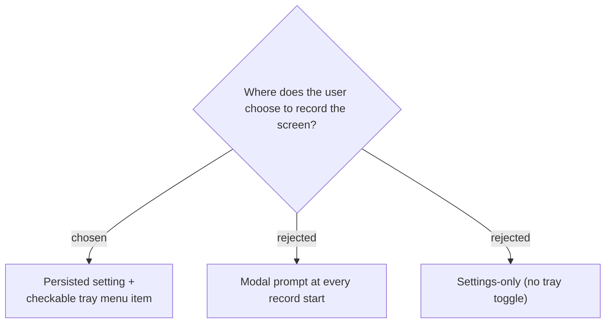

# Screen recording is an opt-in toggle (setting + tray), never a per-record prompt

The `screen` track is controlled by a single persisted boolean
(`ScreenRecordingEnabled`), settable from the Settings dialog and from a
checkable tray menu item ("Record screen too"). There is **no per-recording
prompt**: the app's core interaction is instant-start (press hotkey or click tray
→ recording begins), and a modal every time would break that and would not fit
the auto-detect-calls path either. The tray checkbox lets the user flip the
choice per session without opening Settings.

**Consequence:** auto-detect-calls respects the toggle — when a call auto-starts
recording and the toggle is on, the `screen` track records too. The toggle is
read at `Start()`, so changing it mid-recording has no effect until the next
recording.
