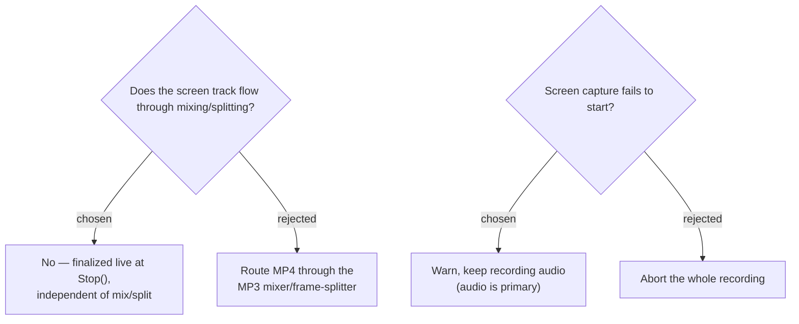

# The screen track bypasses the audio mix/split pipeline and degrades gracefully

The `screen` track is an **independent additive output**. It does **not** go
through `Mp3Mixer` (audio-only) or `Mp3FrameSplitter` (MP3-frame-level — it
cannot split an MP4). ScreenRecorderLib encodes in real time, so on `Stop()` the
MP4 finalizes near-instantly rather than in the existing background
post-processing step that mixing uses. Video splitting is out of scope; if a file
is too large for an uploader the user splits it externally.

Screen capture **degrades gracefully**: if it fails to start (no GPU support,
WGC unavailable, permission), the recording still captures the audio tracks and
the app shows a warning — audio is the primary product, the screen track is
additive. The session must never lose audio because video failed.
