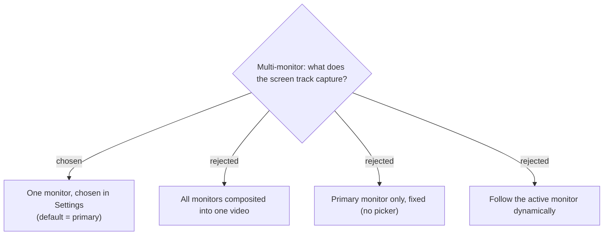

# Record one selectable monitor (default primary), not all monitors

The `screen` track records **one monitor**, selected in Settings via a picker
populated from `Recorder.GetDisplays()` (each `RecordableDisplay` gives a
`FriendlyName` for the label and a `DeviceName` we persist). Default is the
primary monitor (empty setting = primary). This is ScreenRecorderLib's
first-class, most robust mode and matches the dominant use case: the meeting /
screen-share lives on one display.

Rejected:
- **All monitors composited** — supported by the library (add every
  `DisplayRecordingSource`) but produces an awkward ultra-wide / irregular canvas
  for mixed resolutions, bloats the file, and complicates where the key caster
  goes. Out of scope; revisit if asked.
- **Fixed primary only** — fails the moment a screen-share is on a secondary
  monitor; the picker costs little.
- **Follow active monitor** — dynamic re-targeting mid-recording changes output
  resolution and forces re-placing the caster; too much risk for v1.

**Consequences:**
- The **key caster overlay is pinned to the recorded monitor**, not the focused
  one — keystrokes come from a monitor-independent global hook, but the caption
  must sit on the captured monitor's `Screen.Bounds` to land in the video (it
  composites into the WGC/DD frame automatically as long as it never sets
  `WDA_EXCLUDEFROMCAPTURE`). The app must be **PerMonitorV2** DPI-aware and
  re-place the overlay on `DpiChanged` so it stays pixel-correct across mixed-DPI
  monitors. Virtual-screen coordinates can be **negative** (a monitor left of /
  above primary) — placement is driven off `Screen.Bounds`, never assuming
  origin `(0,0)`.
- The mouse-click highlight is a **global** ScreenRecorderLib option (not
  per-monitor); harmless because only one monitor is recorded.
