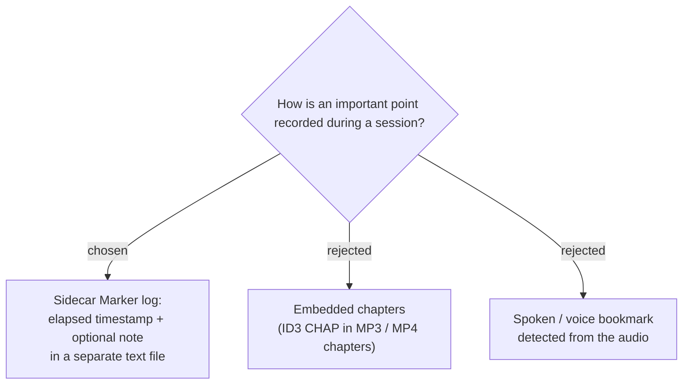

# Markers are timestamped entries in a sidecar file, not embedded chapters

A **Marker** is a timestamped point of interest the user flags while a Recording
Session is running, written to a separate **Marker log** file rather than embedded
into any track. Embedded chapters (B) were rejected because the post-stop pipeline
re-encodes the Mixed file and splits tracks into chunks (see
[ADR 0005](0005-video-bypasses-audio-postprocessing-pipeline.md) and
`RecordingSession.SplitTrack`), which would destroy or misalign any in-file chapter
markers. A spoken bookmark (C) was rejected as unreliable and heavy. A sidecar text
file is robust against the pipeline, trivial to produce, and doubles as a text source
the user can paste into an AI summarizer (NotebookLM) alongside the audio.

**Consequence:** a Marker stores an **elapsed offset from session start**, so it maps
onto every track (System, Mic, Mixed, Screen) which all begin at the same
`_startedAt`. The offset stays meaningful for the human even after the Mixed file is
split into chunks, though it is relative to the *original* continuous recording.
