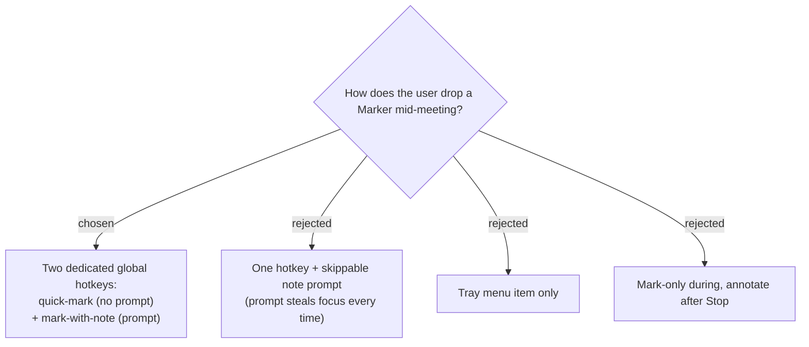

# Markers are triggered by two dedicated global hotkeys (quick-mark + mark-with-note)

Marking is driven by **two dedicated global hotkeys**, both separate from the
existing start/stop hotkey:

- **Quick-mark** — captures the elapsed timestamp instantly with no UI and no focus
  change, so it never interferes with typing in the meeting window.
- **Mark-with-note** — captures the timestamp instantly, then opens a small note
  prompt (which deliberately takes focus, since the user chose this key to type).

A single hotkey with a skippable prompt (B) was rejected because the prompt would
steal focus on *every* mark — including the common case where the user only wants a
quick mark — so stray keystrokes meant for the meeting would land in the note box.
Tray-only (C) is too slow when the user is in another window during a call.
Annotate-after-Stop only (D) was rejected because the user wants the option to jot a
note in the moment. The two-hotkey split keeps the zero-friction path truly
zero-friction while still allowing an in-the-moment note on demand.

**Consequence:** `GlobalHotkey` currently registers a single hotkey (`HotkeyId 9000`).
Supporting marking means registering additional hotkey ids (e.g. 9001, 9002), each
with its own configurable spec persisted in `AppConfig`.
