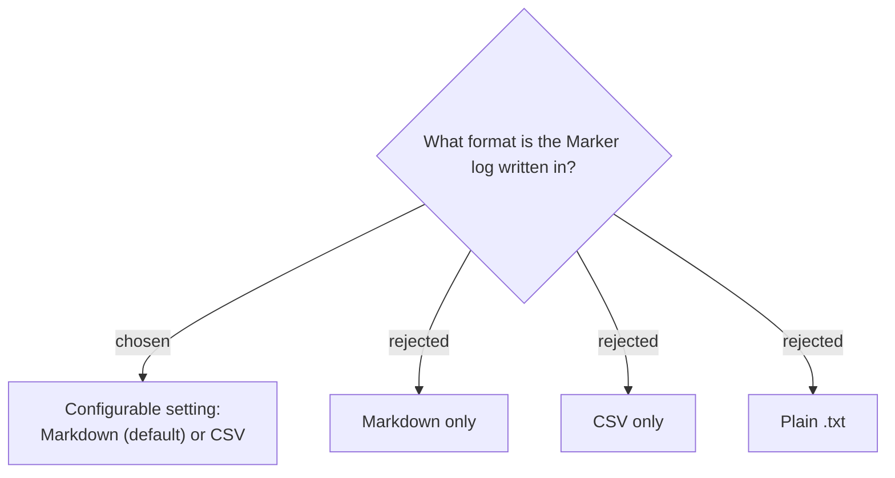

# Marker log format is user-configurable: Markdown (default) or CSV

The Marker log format is a persisted setting (`MarkerLogFormat` = `Markdown` |
`Csv`, default `Markdown`). The file extension follows the choice
(`{prefix}_markers.md` or `{prefix}_markers.csv`). Markdown is the default because it
reads well and can be pasted into an AI summarizer (NotebookLM) as its own text
source; CSV is offered for users who want to open the log in Excel and sort/filter.

Each Marker entry carries four fields regardless of format: a **sequence number**
(#1, #2…), the **elapsed offset** from session start (`HH:MM:SS`), the **wall-clock
time** of the press, and an **optional note**.

- **Markdown:** `- **#1 · 00:12:34** _(14:32:39)_ — note`
- **CSV:** header `Number,Elapsed,WallClock,Note` then one row per marker, with
  standard CSV quoting so notes containing commas, quotes, or newlines stay valid.

**Consequence:** the writer must escape CSV fields correctly, and the log file's
extension is not fixed — code that moves the log into the Session folder
(`TryRenameToSessionFolder`) must use the configured extension, not a hard-coded one.
