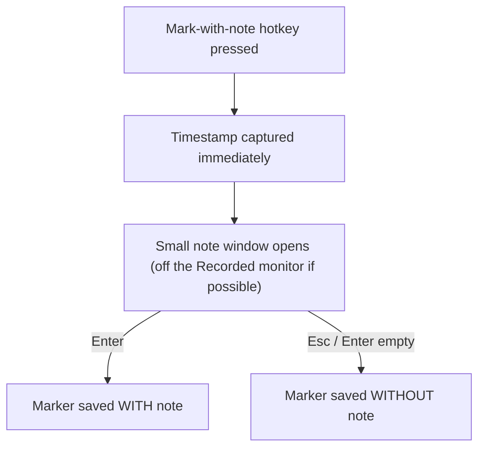

# Mark-with-note prompt: timestamp captured on press, Esc keeps the marker note-less

The note prompt is a normal small window, not a captured overlay. Three decisions:

- **Timestamp on press, not on submit.** The elapsed offset is recorded the instant
  the hotkey fires; whatever the user types is decoration attached to an
  already-saved Marker. So a slow typist still gets an accurate timestamp.
- **Esc keeps the Marker, note-less.** Because the Marker already exists from the
  moment of the press, dismissing the note box with Esc (or pressing Enter on an
  empty box) saves the Marker without a note — it does **not** discard it. Cancelling
  the note is not the same as cancelling the mark.
- **Avoid the Recorded monitor.** When more than one display is present, the note
  window opens on a display other than the one the `screen` track is capturing, so the
  private note does not appear in the MP4. With a single display it may appear in the
  recording — accepted, since the user chose to type. Teams screen-share is outside
  the app's control: the guideline is to use **quick-mark** (no window) while sharing.
