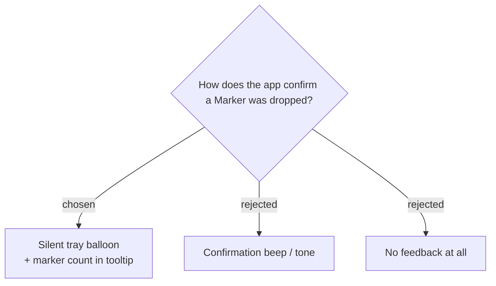

# Marker feedback is visual-only — a confirmation sound would leak into the System track

Dropping a Marker is confirmed **visually only** — a brief tray balloon
(`Marker #3 · 00:12:34`) and a live count in the recording tooltip
(`Recording 00:12:34 · 3 markers`). A confirmation **sound was rejected**: the
System track captures system/loopback audio, so any tone the app plays through the
speakers would be recorded into the System track (and the Mixed file), corrupting the
very recording the user is marking. The mark-with-note window is its own feedback for
that path.

**Consequence:** when a marker hotkey is pressed while **idle** (no Recording Session
running), there is nothing to mark; the app shows a brief balloon
(`Not recording — start first`) rather than silently doing nothing, so the user isn't
left wondering whether the key worked. Any future "audible confirmation" request must
be refused on the same grounds, or routed to a device that is not the recorded
loopback.
