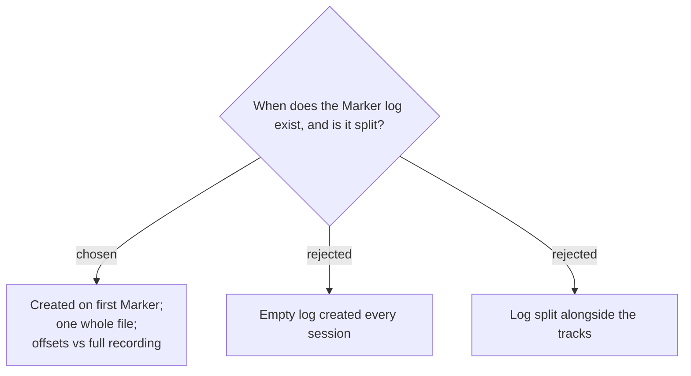

# Marker log is created lazily, kept whole, with offsets relative to the full recording

The Marker log is created **lazily** — the file is written only once the first Marker
is dropped, so a session with no markers leaves no log file behind. The log is
**never split**: splitting exists to keep MP3 tracks under the AI summarizer's upload
limit (`RecordingSession.SplitTrack`), but the log is a tiny text file, so it stays a
single file. Marker offsets remain **relative to the full, continuous recording** from
`_startedAt`, even when the audio tracks are later cut into chunks — the reader maps
`#3 · 00:41:52` onto whichever chunk covers that time themselves.

**Consequence:** the Marker log participates in the move into the Session folder
(`TryRenameToSessionFolder`) like the other artifacts, but not in `SplitTrack`. Code
that finalizes a session must treat "no markers ⇒ no log file" as the normal case, not
an error.
