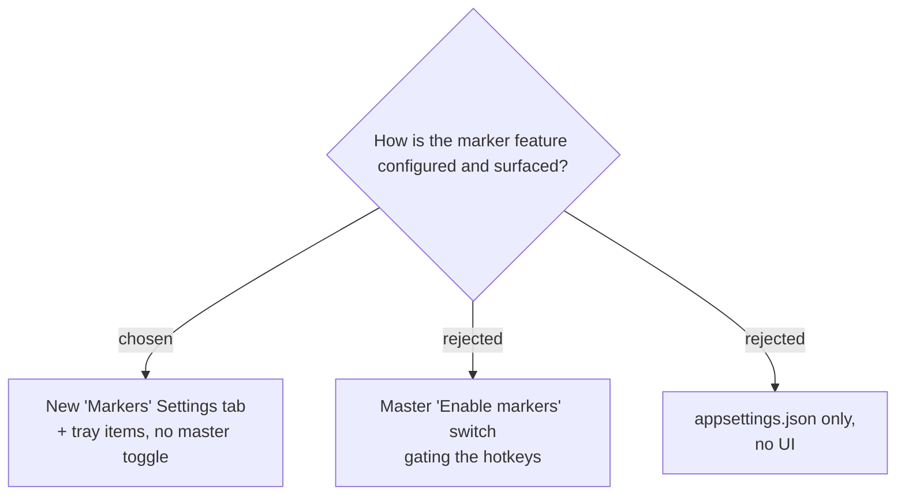

# Markers surfaced via a Settings tab + tray items, with no master on/off toggle

The feature is surfaced consistently with the existing app:

- A new **"Markers" tab** in `SettingsForm` holding two `HotkeyCaptureControl`s
  (quick-mark, mark-with-note) and a Markdown/CSV format radio.
- Two **tray menu items** — "Add marker" and "Add marker with note…" — enabled only
  while a Recording Session is running, for discoverability and use at the machine.
- **No master on/off toggle.** Marking is passive (it only acts when a hotkey is
  pressed or a tray item is clicked), so a separate enable switch adds nothing; a user
  who doesn't want markers simply never triggers one.

New `AppConfig` fields (persisted): `QuickMarkHotkey` (default `Ctrl+Alt+M`),
`MarkWithNoteHotkey` (default `Ctrl+Alt+N`), `MarkerLogFormat` (default `Markdown`).

**Consequence:** the app now registers up to three global hotkeys. Settings
validation must reject a marker hotkey that duplicates the start/stop hotkey or the
other marker hotkey, and a marker hotkey that fails to register (already in use by
another app) must warn the same way the start/stop hotkey already does in `TrayApp`.
