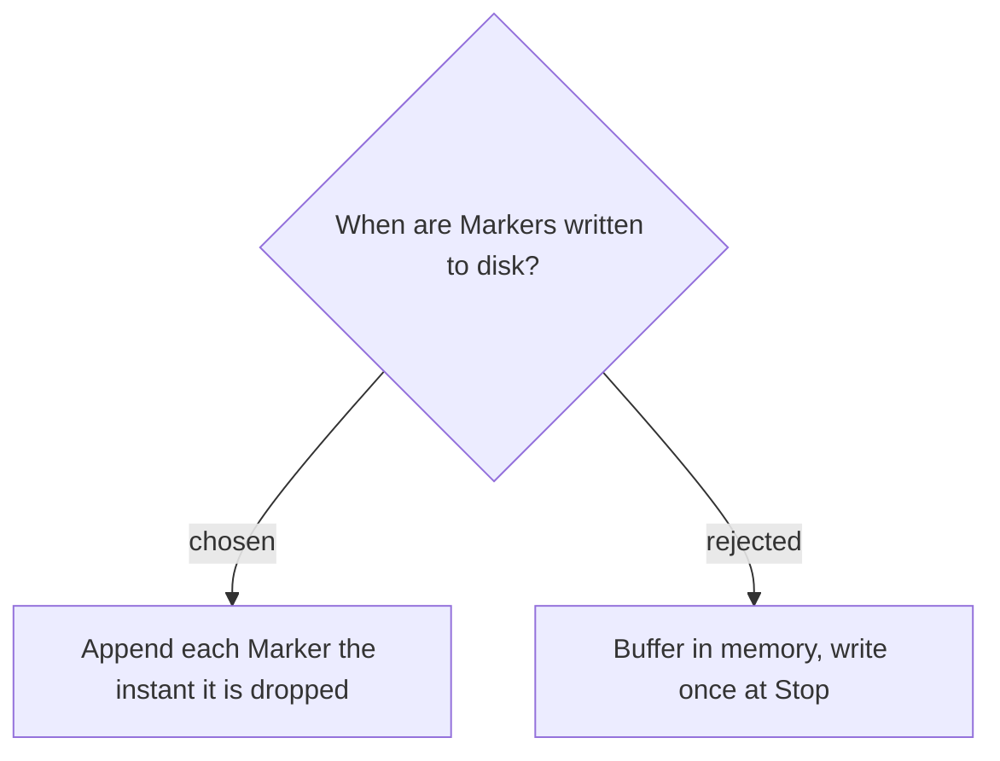

# Markers are appended to disk immediately, header finalized at Stop

Each Marker is written to the Marker log **the moment it is dropped**, not buffered in
memory until Stop. Markers are the entire value of the feature, and a meeting can run
long; buffering would lose every marked moment if the app or PC crashes before the
user stops the recording. Live append makes any already-dropped marker durable.

Only the marker **lines** are appended live; the title block (`# Markers — <label>`
plus the `· N markers` count) is written **once at Stop**, because both the session
label and the final count are known only then. Crash-safety is preserved: a crash
mid-session leaves a header-less but fully readable list of marker lines on disk.

**Consequence:** the Marker log file handle/path is owned by `RecordingSession` for the
life of the session, opened lazily on the first marker (append mode). In `Stop()` the
writer is **closed first**; then, after any rename has moved the log into the Session
folder (so the path/label are final), `MarkerLog.FinalizeMarkdownTitle` prepends the
title block once (Markdown only — CSV carries no count and needs no finalize). An
`AddMarker` write failure must surface as a `Warning` (like other I/O failures) without
tearing down the recording.
