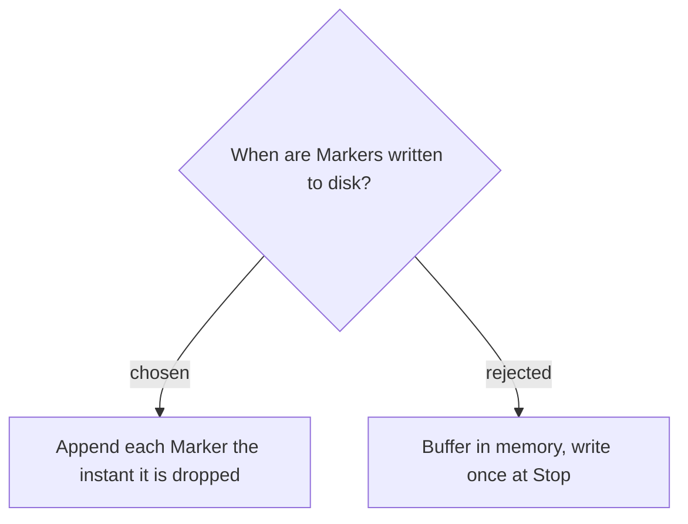

# Markers are appended to disk immediately, header finalized at Stop

Each Marker is written to the Marker log **the moment it is dropped**, not buffered in
memory until Stop. Markers are the entire value of the feature, and a meeting can run
long; buffering would lose every marked moment if the app or PC crashes before the
user stops the recording. Live append makes any already-dropped marker durable.

The only cost is the `· N markers` count in the header, which isn't known until the
end — so the header is written on first marker without the count (or with a
placeholder) and the count is filled in by a final single-line pass at Stop. This
keeps both the crash-safety and the tidy header.

**Consequence:** the Marker log file handle/path is owned by `RecordingSession` for the
life of the session, opened lazily on the first marker (append mode), and closed and
header-finalized in `Stop()` before the move into the Session folder. An `AddMarker`
write failure must surface as a `Warning` (like other I/O failures) without tearing
down the recording.
