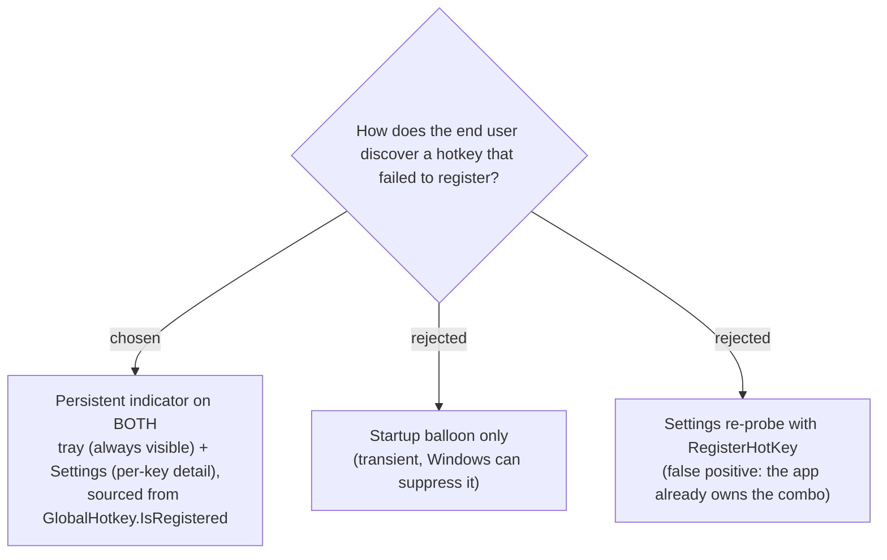

# Inactive-hotkey status is surfaced on both tray + Settings, sourced from IsRegistered

When a configured global hotkey fails to register because another app already owns
the combo, the user must be able to discover it **at any time**, not only via a
transient startup balloon. The status is surfaced on **two durable surfaces**: the
**tray** (an always-visible signal that some hotkey is inactive, with a menu entry to
open Settings) and **Settings** (per-hotkey detail: which key is inactive and why).

The source of truth is **`GlobalHotkey.IsRegistered`** — whether *our* `RegisterHotKey`
call succeeded — held by `TrayApp`. A Settings-side re-probe was rejected because
`RegisterHotKey` is global-per-combo: once the app has registered a combo, re-probing
the same combo from the Settings control always fails, so a probe cannot distinguish
"we own it (fine)" from "another app owns it (conflict)". That is exactly why
`HotkeyCaptureControl.SetInitialHotkey` skips the probe today.

**Consequence:** `TrayApp` must expose the live registration status of all three
hotkeys, and `SettingsForm` must receive that status (rather than re-probing) to show
an accurate per-key indicator for the currently-loaded hotkeys.
