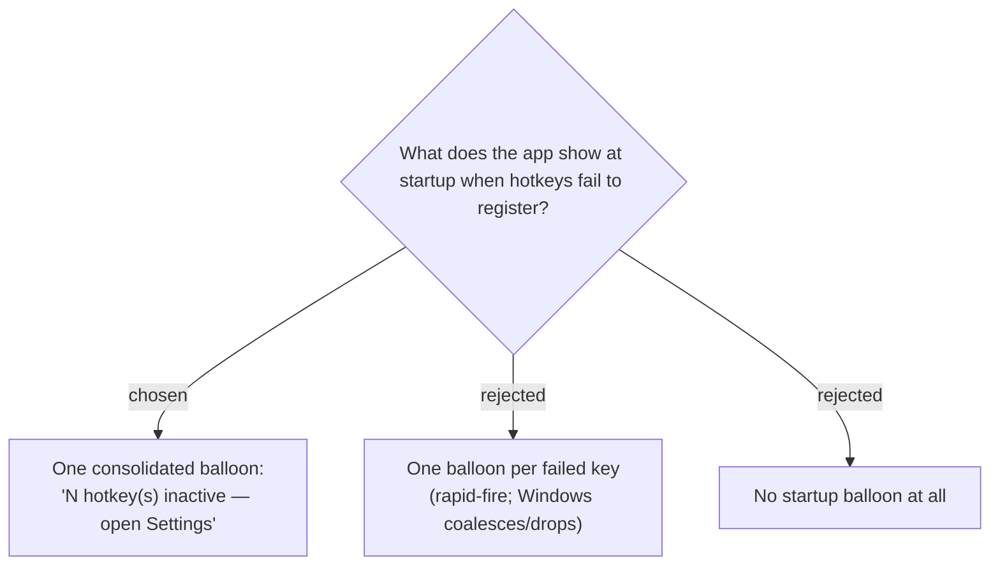

# Startup conflict alert is a single consolidated balloon, not one per key

At startup, if one or more hotkeys fail to register, the app shows **one consolidated
balloon** summarising the count and pointing to Settings — not a separate balloon per
failed key. Per-key balloons were rejected because two or three rapid `ShowBalloonTip`
calls get coalesced or dropped by Windows (the same suppression that motivated this
whole change). Dropping the balloon entirely was rejected because, on machines where
notifications are enabled, an immediate first alert is genuinely useful.

The balloon is only a **first alert**; it is explicitly *not* relied upon (it can still
be suppressed). The durable per-key detail lives on the tray and in Settings
(see [ADR 0015](0015-hotkey-conflict-surfaced-on-tray-and-settings-from-isregistered.md)).

**Consequence:** `RegisterHotkeys` must collect the set of failed registrations and
raise a single summary balloon after attempting all three, instead of `MakeHotkey`
showing a balloon inline per key.
