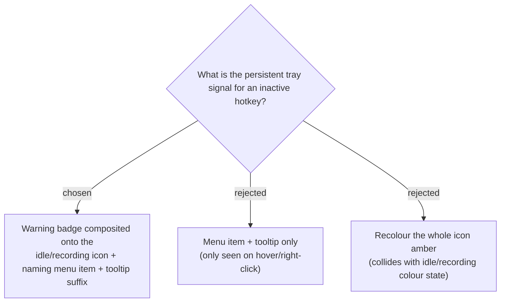

# Tray inactive-hotkey indicator is a warning badge composited over the existing icon

When any hotkey is inactive, the tray shows a small **warning badge** (e.g. an amber
dot/triangle in a corner) **composited over** the existing icon — independent of the
idle (gray) / recording (red) base colour — plus a tray menu item naming the inactive
hotkey(s) that opens Settings, plus a tooltip suffix. The badge is the point: the
motivation is that an end user must *notice* a silently-failed hotkey without already
suspecting one, which a menu item (hover/right-click only) can't do. Recolouring the
whole icon was rejected because it collides with the idle/recording colour state; a
composited badge layers cleanly over either base.

**Consequence:** `IconFactory` gains a way to overlay a warning badge on either base
icon (idle/recording), so the icon state becomes base-colour × badge-on/off. `TrayApp`
chooses the badged variant whenever any of the three hotkeys is inactive, in both the
idle and recording icon-update paths.
