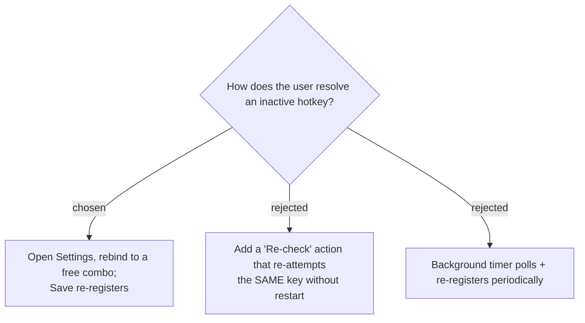

# Inactive hotkeys are resolved by rebinding in Settings — no re-check or polling

The indicators (tray badge/menu, Settings) only need to **route the user to the fix**:
open Settings and rebind the conflicting hotkey to a free combo. Saving a changed
hotkey already re-runs registration (`OnConfigChanged` → `RegisterHotkeys`), so the
fix needs no new machinery. A manual "re-check the same key" action (B) was rejected
as a rare edge case (the conflicting app released the combo and the user wants the same
key back without restarting). Background polling (C) was rejected as unnecessary —
conflicts almost always exist at startup, and polling adds a timer + churn for little
gain (YAGNI).

**Consequence:** after `RegisterHotkeys` runs (at startup and on every settings Save),
`TrayApp` must refresh the tray icon (badge on/off), the menu item, and the tooltip
from the fresh `IsRegistered` results, so the indicators **clear automatically** once
the user rebinds to a working combo. No new re-check command or timer is added.
