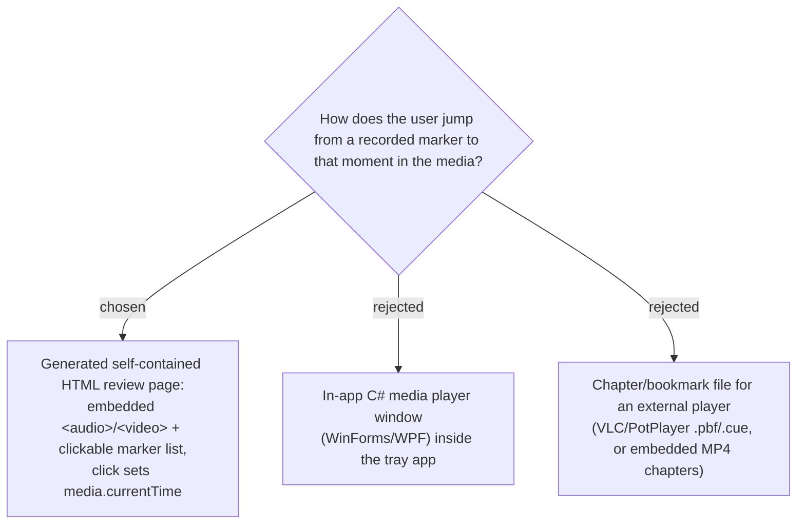

# Navigable markers delivered as a generated HTML review page

Markers today are a text-only sidecar **Marker log** (ADR 0007); the user reads
`00:12:34` and scrubs their player by hand. To make a marker *navigable* — press it
and the media jumps there — SPRecorder emits a self-contained HTML review page
alongside the tracks: a single `.html` file with inline CSS/JS, an embedded
`<audio>`/`<video>` element pointing at the sibling track(s), and a clickable list of
markers; clicking a marker sets `media.currentTime` to its elapsed offset.

An **in-app C# player (B)** was rejected because it bolts a whole media-playback
subsystem onto a deliberately minimal tray recorder and contradicts the standing
"no in-app viewer" non-goal. An **external chapter file (C)** was rejected because it
is player-specific (each player has its own bookmark format) and clunky for MP3
audio, and embedding MP4 chapters re-opens the "not embedded" decision in ADR 0007.
The HTML page keeps the tracks untouched (ADR 0007 stands — nothing is embedded), the
browser is the player so no playback code lands in C#, and the same page serves both
the video and the audio-only case. It fits the portable-ZIP distribution spirit
(works offline, no installer).

## Consequences

- The page references the media by **relative filename**, not embedded bytes (tracks
  are tens-to-hundreds of MB) — so the `.html` must live in the same folder as the
  tracks and travels with them.
- Playback depends on the **browser** supporting the track codecs (H.264+AAC MP4, MP3)
  — true for Chrome/Edge, the default Windows browser.
- The page must be generated **after post-processing** (mix/split) so it references the
  final set of files; split audio needs a per-chunk timeline (see follow-up ADR).
