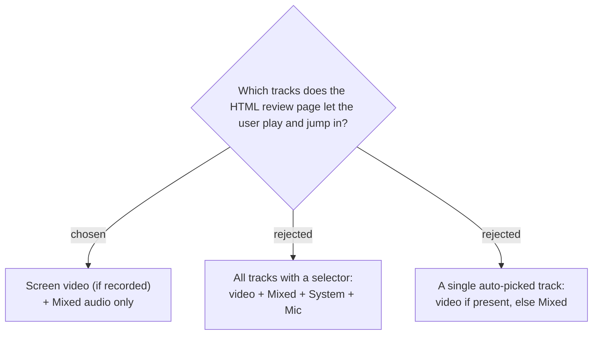

# The review page exposes only the Screen video and the Mixed audio

The review page is for jumping to marked moments in *the recording you review* — which
is the Screen video when it exists, otherwise the Mixed audio (the one coherent
conversation, per CONTEXT.md). The **System** and **Mic** tracks are kept as the local
archive (CONTEXT.md "Mixed file"), not the thing a human scrubs, so the page does not
expose them. If both exist the page defaults to the video and lets the user switch to
Mixed; with only one present it shows that one.

A full selector over all four tracks (B) adds clutter for tracks nobody reviews
moment-by-moment; a single hard-locked track (C) removes the legitimate "I recorded
screen but want to re-hear it as audio" switch. Scoping to video + Mixed keeps the page
focused while preserving the one useful toggle. This "no" is reversible — System/Mic
can be added later if a need appears.
