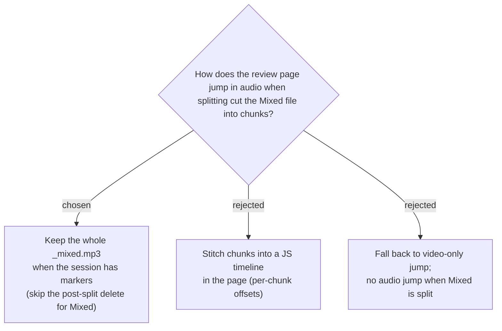

# The whole Mixed file is preserved when a session has markers

Splitting normally deletes the whole `_mixed.mp3` after producing `_001/_002…` chunks
(ADR/spec for audio splitting; [RecordingSession.cs](../../src/SPRecorder/Recording/RecordingSession.cs)
`SplitTrack` → `File.Delete`). The review page jumps by setting `media.currentTime`,
which is trivial and exact against **one continuous file**. So when a session has ≥ 1
marker, SPRecorder **keeps the whole Mixed file** (skips the delete for the Mixed track
only — System/Mic still delete their originals), giving the page a continuous audio
file. Stitching chunks into a per-chunk JS timeline (B) was rejected as needless code
when keeping one file is simpler; video-only fallback (C) was rejected because it loses
audio jump for audio-only sessions that split.

## Consequences

- When markers + splitting + a Mixed file all coincide, disk holds **both** the whole
  Mixed file (for review) and its chunks (for upload). Accepted: markers signal the user
  cares about review; the redundancy is scoped to that case.
- Google Drive **Upload is not yet implemented**. When it is, it must upload the
  **chunks** (the reason for splitting is the ≤ 200 MB cap) — never the preserved whole
  file. Flagged here so the future upload work does not regress the split goal.
- If `MixedFileEnabled` is false there is no Mixed file at all; an audio-only session
  then offers no audio in the review page (only video, if recorded). Edge case, accepted.
