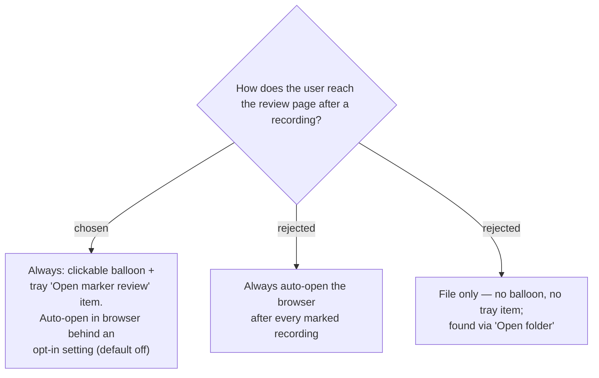

# Review page access: clickable balloon + tray item, with opt-in auto-open

When a marked session finishes post-processing, SPRecorder shows a **clickable balloon**
("Marker review ready") and exposes a tray menu item **"Open marker review"** that opens
the last session's page — consistent with the app's existing balloon feedback and "Open
folder" item. A new `AppConfig.AutoOpenMarkerReview` (bool, **default false**, toggled on
the Settings → Markers tab) additionally launches the page in the default browser when
on. Always-auto-open (B) was rejected as intrusive (a browser pops up after every marked
recording); file-only (C) was rejected as undiscoverable. Default-off auto-open keeps the
quiet default while letting power users opt into one-click review.

## Consequences

- One new config field (`AutoOpenMarkerReview`) added to `AppConfig`/`appsettings.json`
  and a checkbox on the existing Markers tab.
- The tray needs to remember the **last session's review-page path** to wire "Open marker
  review" (similar to how it already tracks the last output for "Open folder").
- The balloon and tray item appear only when the finished session actually produced a
  review page (i.e. it had ≥ 1 marker).
