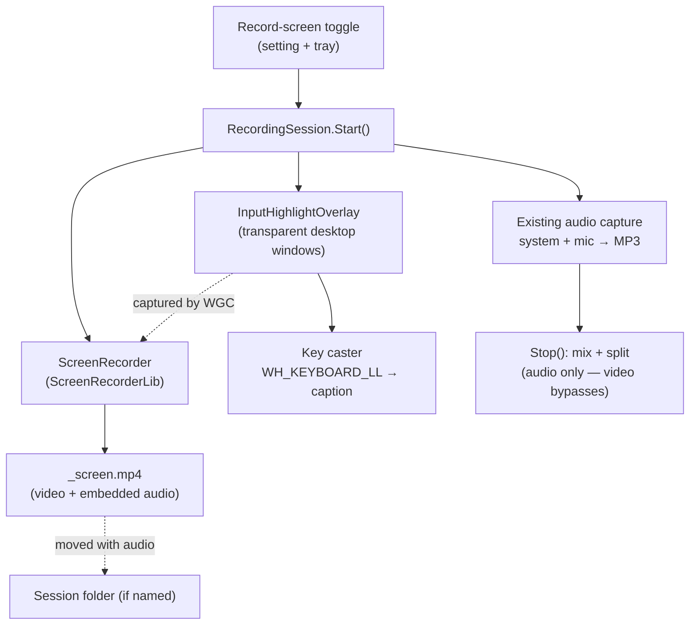
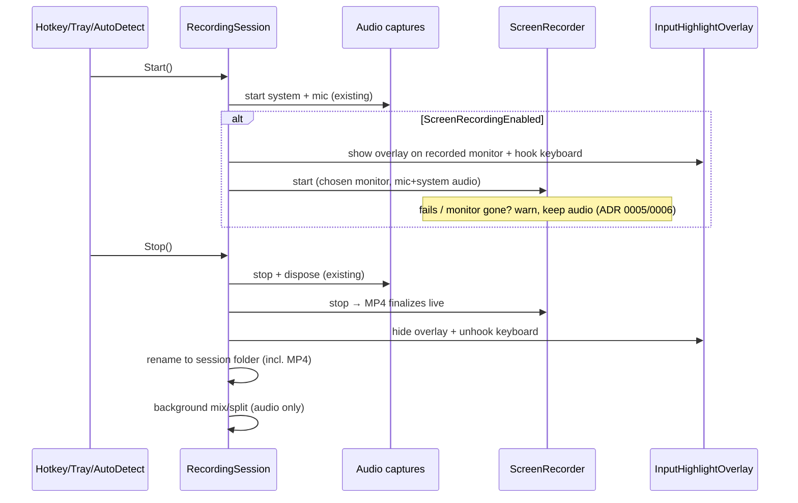

# Screen Recording — Design Spec

Adds an optional **screen track**: a self-contained MP4 of one chosen monitor
(default primary) with the meeting audio embedded, plus on-screen mouse-click and
keystroke highlights. Opt-in via a persisted toggle (Settings + tray). Additive —
the existing system / mic / mixed MP3 pipeline is untouched. Ships as a folder
(`SPRecorder.exe` + `ScreenRecorderLib.dll`), not a single file (ADR 0002).



The diagram shows the screen track as a third capture path that runs in parallel
with the existing audio capture, gated by the toggle, with the highlight overlay
rendered onto the desktop so Windows.Graphics.Capture pulls it into the MP4.

## Goals

- Optional MP4 of one chosen monitor (default primary), recorded in sync with
  the audio tracks (ADR 0006).
- Audio (system + mic) embedded in the MP4 so it plays standalone (ADR 0001).
- Mouse-click ripple + KeyCastr-style keystroke caption baked into the video
  (ADR 0003).
- No installer — distributed as a copy-and-run folder (ADR 0002).
- Audio recording is never compromised by a video failure (ADR 0005).

## Non-goals

- Window-only or arbitrary-region capture.
- **All-monitors-combined** capture (the library supports it, but it is out of
  scope — ADR 0006); and dynamic "follow the active monitor".
- Video splitting or routing the MP4 through the audio mix/split pipeline
  (ADR 0005).
- Editing/annotation, webcam overlay, ARM64 publish, single-file `.exe`.

## Decisions (see `docs/adr/`)

| ADR | Decision |
|---|---|
| 0001 | Screen track = self-contained MP4 with embedded audio |
| 0002 | Capture/encode via ScreenRecorderLib; folder distribution, Platform=x64 |
| 0003 | Highlights via captured overlay windows; key caster shows all keys |
| 0004 | Opt-in toggle (setting + tray), no per-record prompt |
| 0005 | Video bypasses mix/split; degrades gracefully on failure |
| 0006 | Record one selectable monitor (default primary), not all monitors |

## Configuration

New fields on [`AppConfig`](../../../src/SPRecorder/Configuration/AppConfig.cs)
(record, with defaults; bound from `appsettings.json`):

```csharp
public bool   ScreenRecordingEnabled { get; init; } = false;   // the toggle
public string ScreenMonitorDeviceName{ get; init; } = "";      // "" = primary; else \\.\DISPLAYn
public int    ScreenFrameRate        { get; init; } = 30;       // 15 | 25 | 30
public string ScreenQuality          { get; init; } = "Medium"; // Low|Medium|High
public bool   ShowMouseClicks        { get; init; } = true;
public bool   ShowKeystrokes         { get; init; } = true;     // key caster
```

`AppConfig.Load` clamps `ScreenFrameRate` to {15,25,30} and normalizes
`ScreenQuality`. Quality maps to an H.264 bitrate/quality preset inside the
`ScreenRecorder` wrapper (exact numbers settled during implementation).
`ScreenMonitorDeviceName` holds the chosen monitor's `DisplayRecordingSource.DeviceName`
(empty → `DisplayRecordingSource.MainMonitor`); if a saved monitor is no longer
present at `Start()`, fall back to primary and warn.

## Output & naming

- The screen file is built from the existing `FileNamePattern` with
  `{track}` = `screen`, then the extension is forced to `.mp4` (the pattern
  ends in `.mp3`; video swaps it). Result e.g.
  `2026-06-18_14-03-22_screen.mp4`.
- When the user names the session, the MP4 moves into the session folder
  alongside the MP3s in `TryRenameToSessionFolder` — add `ScreenFilePath` to the
  rename set.
- `RecordingSession` gains `public string? ScreenFilePath { get; private set; }`.

## Recording lifecycle



Key points:
- The toggle is read once at `Start()` (ADR 0004); mid-recording changes apply
  next time.
- `ScreenRecorder.Stop()` finalizes the MP4 near-instantly — it is **not** part
  of `StartPostProcessingInBackground`, which stays audio-only.
- All screen teardown is wrapped so a failure can't block audio teardown.

## New components

- **`Recording/ScreenRecorder.cs`** — thin wrapper over ScreenRecorderLib:
  builds a single `DisplayRecordingSource` for the chosen monitor (by
  `DeviceName`, else `MainMonitor`), system + mic audio, frame rate, quality, and
  the global `MouseOptions` click highlight; exposes `Start(path)`, `Stop()`,
  `static GetDisplays()` (for the Settings picker), and a `Failed` event surfaced
  via the existing `RecordingSession.Warning`.
- **`Overlay/InputHighlightOverlay.cs`** — owns the key caster: a transparent,
  topmost, click-through (`WS_EX_LAYERED | WS_EX_TRANSPARENT`) layered window
  **pinned to the recorded monitor's `Screen.Bounds`** (not the focused monitor;
  bounds may be negative) showing recently pressed keys, fed by a global
  low-level keyboard hook (`WH_KEYBOARD_LL`); fades entries out. Re-places itself
  on `Form.DpiChanged` so it stays pixel-correct across mixed-DPI monitors.
  Installed only while recording with `ShowKeystrokes` on; unhooked on stop.
  Never sets `WDA_EXCLUDEFROMCAPTURE` so it composites into the captured frame.
  (Mouse highlight is the library's own, so the overlay is keyboard-only.)
- The app must run **PerMonitorV2** DPI-aware
  (`Application.SetHighDpiMode(HighDpiMode.PerMonitorV2)`) for the overlay to land
  correctly on mixed-DPI setups.
- Both are constructed/torn down inside `RecordingSession` under the toggle.

## Settings UI

New **"Screen"** tab in
[`SettingsForm`](../../../src/SPRecorder/Settings/SettingsForm.cs), matching the
existing tab pattern:
- Checkbox "Record screen too".
- Group (enabled when checked): **monitor dropdown** (populated from
  `ScreenRecorder.GetDisplays()`, first item "Primary monitor"; mirrors the
  Audio tab's device-picker pattern), frame rate dropdown, quality dropdown,
  "Highlight mouse clicks", "Show keystrokes on screen".
- A privacy hint under the keystroke option: *"Shows every key you press in the
  video — avoid typing passwords while recording."*

Tray ([`TrayApp`](../../../src/SPRecorder/Tray/TrayApp.cs)): a checkable
"Record screen too" item whose `Checked` mirrors the setting and whose click
saves the flipped config via `AppConfigStore` (reusing the existing
`ConfigChanged` path).

## Privacy

The key caster records every keystroke into the video (ADR 0003). README gains a
note alongside the existing compliance note; the Settings hint warns inline. The
keyboard hook is active only during a screen recording and never writes
keystrokes to disk.

## Defaults to confirm at review

- **Frame rate:** 30 fps (smooth for showing clicks/keys). Alt: 25/15 for
  smaller files.
- **Quality:** "Medium" default (≈ a few MB/min at 1080p H.264).
- **Resolution:** native resolution of the recorded monitor (no downscale).
- **Recording border:** use ScreenRecorderLib's default `RecorderApi =
  DesktopDuplication`, which has **no capture border** and needs no Win11 — so
  the yellow-border problem is avoided entirely (the border only appears with the
  `WindowsGraphicsCapture` API).

## Packaging & deployment (ADR 0002)

- Build with **`Platform = x64`** (ScreenRecorderLib's `.targets` rejects
  `AnyCPU`). Update `SPRecorder.csproj` / publish profile accordingly.
- **Drop single-file publish** for the screen-enabled build: the mixed-mode
  `ScreenRecorderLib.dll` cannot live inside a self-extracting single file. Ship
  the published **folder** (`SPRecorder.exe` + `ScreenRecorderLib.dll` +
  `appsettings.json` + any companion native DLLs).
- **README update:** change the "copy `SPRecorder.exe` and `appsettings.json`"
  instruction to "copy the published folder"; note prerequisites — **Visual C++
  Redistributable** and **Media Foundation** (present on normal Win10/11; needs
  the Media Feature Pack on N/KN editions).

## Testing

- Pure/unit-testable: `AppConfig.Load` clamping of the new fields; filename
  builder producing `_screen.mp4`; session-folder rename including the MP4 path.
- Not unit-testable (manual verification): actual capture, overlay rendering,
  keyboard hook, A/V sync — verified by recording a short clip and inspecting the
  MP4 + highlights. Keep ScreenRecorderLib behind the `ScreenRecorder` wrapper so
  `RecordingSession` logic stays testable without the native dependency.

## Risks

- **Packaging migration** — moving from single-file to a folder + `Platform=x64`
  touches the build/publish setup and README; validate the published folder runs
  on a clean machine (VC++ runtime + Media Foundation present).
- **Mixed-DPI overlay placement** — the key caster must land pixel-correct on the
  recorded monitor under PerMonitorV2; verify on a mixed-scale two-monitor setup,
  including a monitor with negative virtual-screen coordinates.
- **Two audio capture stacks at once** (existing NAudio MP3s + the library's
  embedded audio). Expected to coexist in WASAPI shared mode; confirm no device
  contention.
- **Global keyboard hook** may trip some endpoint-security tooling — document.
