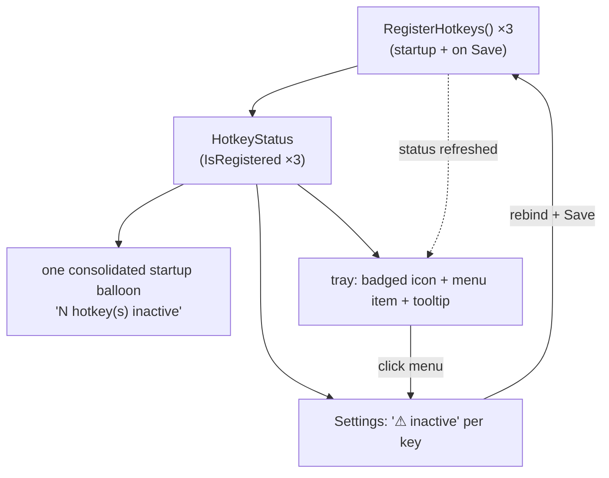
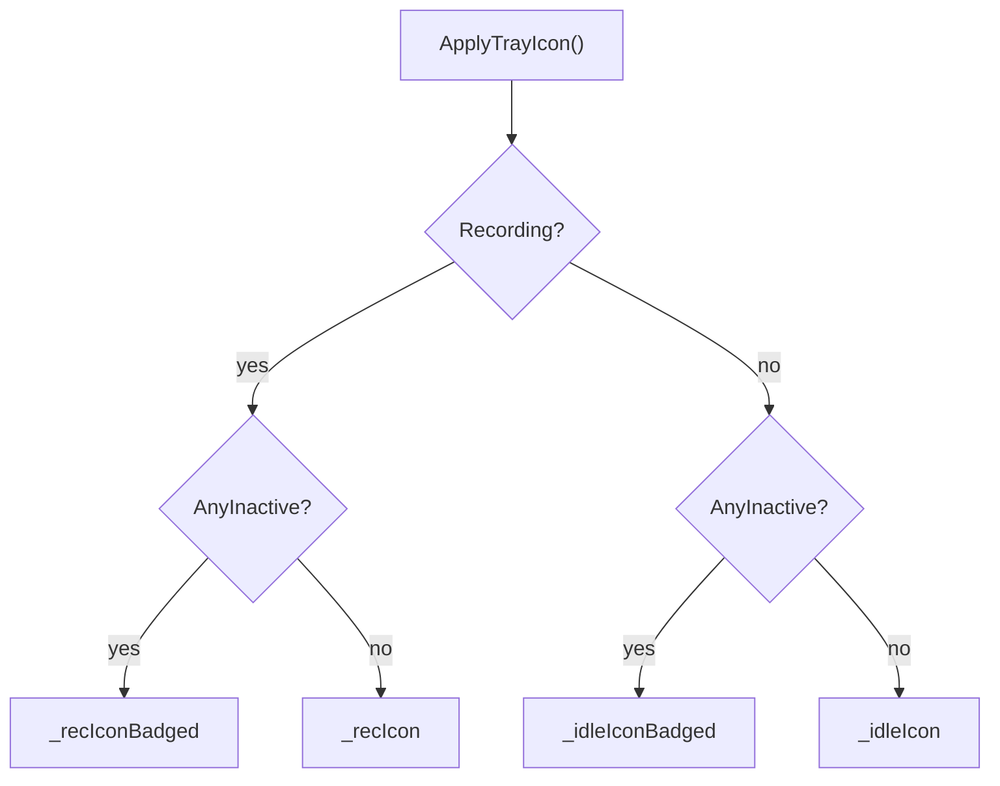
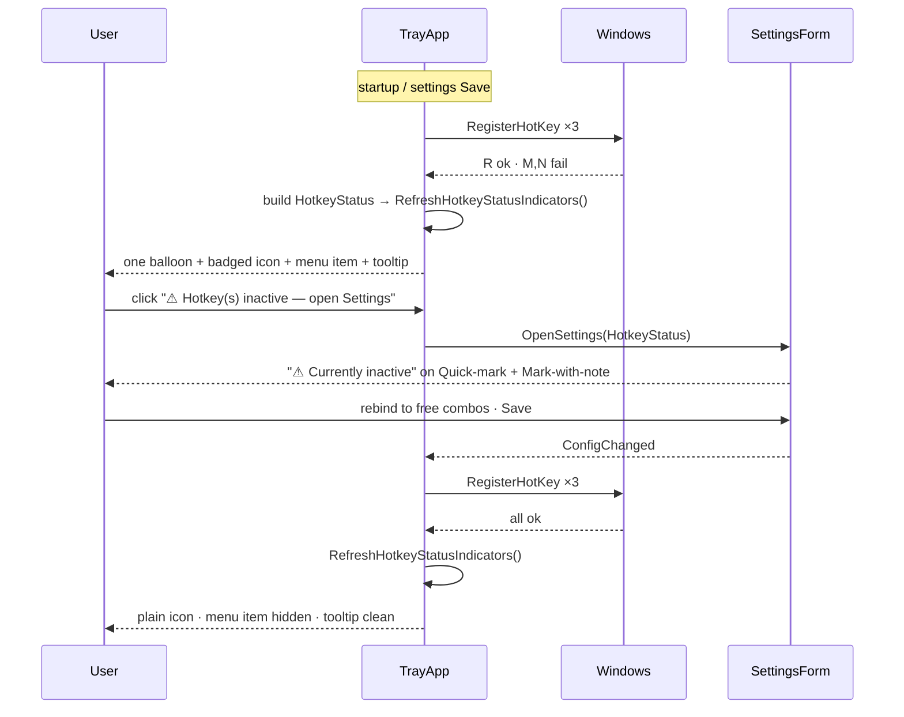

# Inactive-hotkey notification — design spec

Make a global hotkey that fails to register (another app owns the combo) **durably
discoverable** by the end user — a persistent tray badge + a Settings per-key
indicator — instead of relying only on a transient startup balloon that Windows can
suppress.



The diagram shows the single source of truth (`HotkeyStatus`, built from each
`GlobalHotkey.IsRegistered`) fanning out to three surfaces — the startup balloon, the
tray, and Settings — and the resolution loop: the user rebinds in Settings, Save
re-runs `RegisterHotkeys`, and the refreshed status clears the indicators.

---

## 1. Context & goal

SPRecorder registers three global hotkeys (`TrayApp.RegisterHotkeys` →
`MakeHotkey` → `new GlobalHotkey(parsed, id)` → Win32 `RegisterHotKey`): start/stop
(9000, `Ctrl+Alt+R`), quick-mark (9001, `Ctrl+Alt+M`), mark-with-note (9002,
`Ctrl+Alt+N`). `GlobalHotkey.IsRegistered` records whether *our* registration
succeeded. Today the only conflict signal is a per-key balloon at startup (Windows
routinely suppresses it) plus a Settings probe that only runs when the user
interactively types a new key. A hotkey that silently fails to register is therefore
undiscoverable — the gap this design closes. See **Inactive hotkey** in
[CONTEXT.md](../../../CONTEXT.md).

**Decisions** (read first):
[ADR 0015](../../adr/0015-hotkey-conflict-surfaced-on-tray-and-settings-from-isregistered.md)
both surfaces, source = `IsRegistered` ·
[ADR 0016](../../adr/0016-startup-conflict-alert-is-a-single-consolidated-balloon.md)
one consolidated balloon ·
[ADR 0017](../../adr/0017-tray-inactive-hotkey-indicator-is-a-composited-badge.md)
tray badge + menu + tooltip ·
[ADR 0018](../../adr/0018-inactive-hotkeys-resolved-by-rebinding-no-recheck-or-poll.md)
resolve by rebinding; no re-check/poll.

**Goal:** at any moment, the user can see *that* a hotkey is inactive (tray, at a
glance) and *which one and why* (Settings), and fix it by rebinding.

---

## 2. Source of truth — `HotkeyStatus`

A hotkey is **inactive** when our `RegisterHotKey` failed (`IsRegistered == false`) or
the `GlobalHotkey` is null (the spec failed to parse). Status is **never re-probed** —
re-`RegisterHotKey`-ing a combo the app already owns always fails, a false positive
(ADR 0015); this is exactly why `HotkeyCaptureControl.SetInitialHotkey` skips the probe.

New immutable carrier (new file `src/SPRecorder/Hotkey/HotkeyStatus.cs`):

```csharp
namespace SPRecorder.Hotkey;

/// <summary>Live registration status of the three global hotkeys (true = registered/active).</summary>
public sealed record HotkeyStatus(bool StartStop, bool QuickMark, bool MarkWithNote)
{
    public bool AnyInactive => !StartStop || !QuickMark || !MarkWithNote;

    /// <summary>Human-readable names of the inactive hotkeys, in display order.</summary>
    public IReadOnlyList<string> InactiveLabels()
    {
        var list = new List<string>(3);
        if (!StartStop)    list.Add("Start/stop");
        if (!QuickMark)    list.Add("Quick-mark");
        if (!MarkWithNote) list.Add("Mark with note");
        return list;
    }
}
```

`TrayApp` builds it from the live instances: a hotkey is active iff
`hk is { IsRegistered: true }`. `AnyInactive` and `InactiveLabels()` are pure and
unit-tested; they drive the balloon text, the tray menu label, and (with the booleans)
the Settings per-key indicators.

---

## 3. Tray indicators ([IconFactory.cs](../../../src/SPRecorder/Tray/IconFactory.cs), [TrayApp.cs](../../../src/SPRecorder/Tray/TrayApp.cs))

### 3.1 Badged icon

`IconFactory.CreateCircleWithBadge(Color baseColor, Color badgeColor, int size = 32)`
mirrors the existing `CreateCircle` (32×32 `Bitmap`, `FillEllipse`, return
`Icon.FromHandle(bmp.GetHicon())`, same `using` disposal) and then composites a small
amber badge (~7 px, `Color.FromArgb(255, 193, 7)`) in the lower-right corner with a
thin contrasting outline so it reads over both the gray (idle) and red (recording)
base. Same `GetHicon` handle behavior as today (acceptable for a tray app's lifetime).

`TrayApp` pre-creates **two badged variants** in the constructor alongside the existing
two — `_idleIconBadged`, `_recIconBadged` — and disposes all four in `ExitThreadCore`.
Pre-creating (not compositing on demand) avoids per-state ephemeral `Icon` allocation
and the disposal leak that ephemeral compositing invites.

### 3.2 Icon selection



`ApplyTrayIcon()` sets `_notifyIcon.Icon` from the two axes (recording state ×
any-inactive). `OnStateChanged` calls `ApplyTrayIcon()` instead of assigning the icon
directly. The badge state changes only at registration time, so nothing polls.

### 3.3 Menu, tooltip, consolidated balloon

- **Menu item** (new, consolidated): `"⚠ Hotkey(s) inactive — open Settings"`,
  `Visible` only when `status.AnyInactive`, click → `OpenSettings()`. One item, not
  per-key (consistent with the consolidated balloon). Placed after the marker items.
- **Tooltip:** when inactive, append a short ` · ⚠ hotkey inactive` suffix in
  `UpdateTooltip`, applied to both the idle text and the recording text, keeping the
  existing 63-char truncation guard (the badge is the primary signal; the suffix is
  secondary and must never push past the limit).
- **Consolidated startup balloon:** `RegisterHotkeys` collects the failed roles after
  attempting all three and raises **one** balloon
  (`"{n} hotkey(s) inactive: {labels}. Open Settings to fix."`) when any failed. The
  per-key balloon is **removed** from `MakeHotkey` (ADR 0016); `MakeHotkey` just returns
  the `GlobalHotkey?` (null on parse error) and no longer shows its own balloon.

### 3.4 Single refresh point

`RefreshHotkeyStatusIndicators()` rebuilds the current `HotkeyStatus` from the three
instances and updates: the menu item (visibility + label), the tooltip, and calls
`ApplyTrayIcon()`. It is invoked after `RegisterHotkeys()` at startup and again in
`OnConfigChanged` after re-registration, so a rebind that fixes the conflict clears the
indicators automatically (ADR 0018).

---

## 4. Settings indicators ([SettingsForm.cs](../../../src/SPRecorder/Settings/SettingsForm.cs), [HotkeyCaptureControl.cs](../../../src/SPRecorder/Settings/HotkeyCaptureControl.cs))

`SettingsForm` ctor gains an optional `HotkeyStatus? hotkeyStatus = null` parameter;
`TrayApp.OpenSettings` passes
`new HotkeyStatus(_startStopHotkey is { IsRegistered: true }, _quickMarkHotkey is { IsRegistered: true }, _markWithNoteHotkey is { IsRegistered: true })`.

`HotkeyCaptureControl` gains a method that shows an externally-supplied inactive status
without probing:

```csharp
public void SetInactiveStatus(bool inactive)
{
    HasConflict = inactive;
    _conflictHint.Text = inactive ? "  ⚠  Currently inactive — in use by another app" : "";
}
```

In `ApplyConfigToControls`, immediately after each `SetInitialHotkey(...)` call, the
form calls `SetInactiveStatus(!registered)` for that control using the matching
`HotkeyStatus` boolean (start/stop on the General tab; quick-mark + mark-with-note on
the Markers tab). When `hotkeyStatus` is null, nothing is shown (back-compat).

This does **not** affect the interactive path: when the user types a *new* combo,
`ProcessCmdKey → StopCapture(committed: true) → CheckForConflict` probes it (accurate,
since the new combo isn't owned by us yet) and overwrites the hint. Setting
`HasConflict = true` for a loaded inactive key is safe — `Save_Click` validates via
`HotkeyValidation.Validate`, **not** `HasConflict`, so it does not block saving.

---

## 5. Runtime lifecycle



---

## 6. Component changes

| File | Change |
|---|---|
| `Hotkey/HotkeyStatus.cs` (new) | `record HotkeyStatus(bool,bool,bool)` + `AnyInactive` + `InactiveLabels()` |
| `Tray/IconFactory.cs` | `CreateCircleWithBadge(baseColor, badgeColor, size=32)` |
| `Tray/TrayApp.cs` | `_idleIconBadged`/`_recIconBadged` fields (ctor + dispose); `HasInactiveHotkey()`; `ApplyTrayIcon()`; `RefreshHotkeyStatusIndicators()`; consolidated-balloon collection in `RegisterHotkeys`; remove per-key balloon from `MakeHotkey`; new consolidated tray menu item; `UpdateTooltip` suffix; `OpenSettings` passes `HotkeyStatus`; `OnStateChanged` uses `ApplyTrayIcon()` |
| `Settings/SettingsForm.cs` | ctor `+ HotkeyStatus? hotkeyStatus = null`; `ApplyConfigToControls` calls `SetInactiveStatus` per control |
| `Settings/HotkeyCaptureControl.cs` | `SetInactiveStatus(bool inactive)` |

---

## 7. Edge cases

| Case | Behavior |
|---|---|
| All three hotkeys conflict | Badge on; menu item "3 hotkeys inactive…"; one balloon lists all three; Settings shows ⚠ on all three controls. |
| Parse error (bad spec, `MakeHotkey` returns null) | Treated as inactive (null ⇒ not `{IsRegistered: true}`) — same indicators. |
| Conflict cleared by rebinding | After Save → `RegisterHotkeys` → `RefreshHotkeyStatusIndicators` → badge/menu/tooltip clear automatically. |
| Hotkey becomes inactive while recording | Status only changes at registration time; the badge correctly composites over the red icon via `ApplyTrayIcon()` on the next refresh (startup/Save). Not polled (ADR 0018). |
| Windows suppresses the balloon | Acceptable — the badge + menu + Settings are the durable fallback (the whole point). |
| User opens Settings, a key is inactive, doesn't change it, Saves | The unchanged spec re-registers and likely fails again → indicators stay; no false "fixed". |

---

## 8. Non-goals

- No background polling / periodic re-check; no "re-check the same key" command (ADR 0018).
- No auto-rebinding to a fallback combo.
- No change to *how* hotkeys are registered (ids, mechanism) — only how failure is surfaced.
- The `GetHicon` handle is not manually `DestroyIcon`-ed (unchanged from today; fine for the process lifetime).

---

## 9. Testing

**Unit (pure, TDD):**
- `HotkeyStatus.AnyInactive` — true when any false, false when all true.
- `HotkeyStatus.InactiveLabels()` — correct names + order for each combination (none, one, all).

**Build-gated / manual (WinForms/Win32/tray — the project's established strategy):**
- `IconFactory.CreateCircleWithBadge` returns a non-null `Icon` (smoke).
- Manual: force a conflict (bind a marker key to a combo another app owns, e.g. one already taken), launch → badge appears on the tray icon; one balloon; tray menu shows "⚠ Hotkey(s) inactive — open Settings".
- Manual: open Settings → the conflicting key shows "⚠ Currently inactive — in use by another app"; a non-conflicting key shows nothing.
- Manual: rebind to a free combo, Save → badge + menu item disappear; the new key works.
- Manual: type a brand-new conflicting combo in Settings → the existing live probe still flags it.
