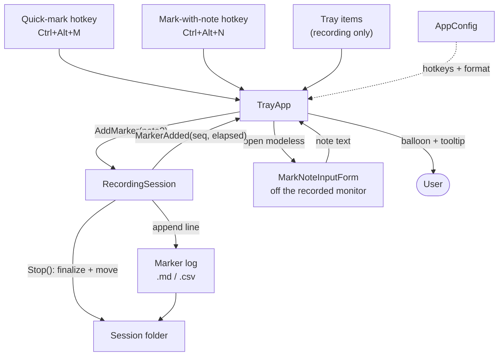
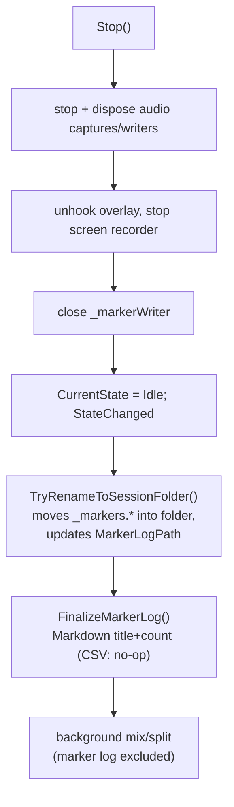
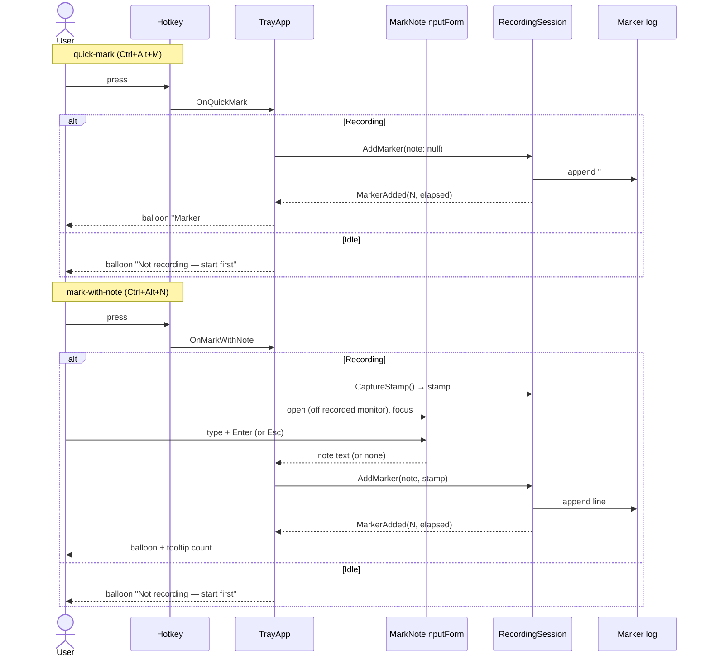

# Markers — design spec

Drop a timestamped "important moment" while a Recording Session is running, so the
user can jump back to it — or hand the list to an AI summarizer — afterward. Markers
live in a sidecar **Marker log** (Markdown or CSV), never embedded in a track.



The diagram shows the two new global hotkeys and the tray items feeding `TrayApp`,
which calls `RecordingSession.AddMarker`; the note window is opened by `TrayApp` and
returns text back; `RecordingSession` owns the Marker log and notifies `TrayApp` for
visual feedback; at `Stop()` the log is finalized and moved into the Session folder.

---

## 1. Context & goal

SPRecorder records a meeting as a System track, a Mic track, an optional Mixed file,
and an optional Screen track — all starting at one `_startedAt`. The user wants to
**flag important moments while recording** and review/summarize them later (the Mixed
file is typically uploaded to NotebookLM). See [CONTEXT.md](../../../CONTEXT.md) for
**Marker** and **Marker log**.

**Decisions captured during grilling** (read these first):
[ADR 0007](../../adr/0007-markers-are-timestamped-sidecar-not-embedded.md) sidecar not
embedded · [ADR 0008](../../adr/0008-markers-triggered-by-two-dedicated-hotkeys.md) two
hotkeys · [ADR 0009](../../adr/0009-marker-log-format-is-configurable-markdown-or-csv.md)
Markdown/CSV · [ADR 0010](../../adr/0010-note-prompt-instant-capture-esc-keeps-marker.md)
instant capture + Esc keeps marker ·
[ADR 0011](../../adr/0011-marker-feedback-is-visual-only-no-sound.md) visual-only feedback ·
[ADR 0012](../../adr/0012-marker-log-created-lazily-kept-whole.md) lazy + whole ·
[ADR 0013](../../adr/0013-markers-surfaced-via-settings-tab-and-tray-no-master-toggle.md)
settings/tray surface ·
[ADR 0014](../../adr/0014-markers-appended-to-disk-immediately.md) append immediately.

**Goal:** the user presses a key during a meeting; a marker lands on disk within
seconds; afterward a small `.md`/`.csv` lists every marked moment with its time and
optional note.

---

## 2. Data model

### 2.1 New `AppConfig` fields ([AppConfig.cs](../../../src/SPRecorder/Configuration/AppConfig.cs))

| Field | Type | Default | Notes |
|---|---|---|---|
| `QuickMarkHotkey` | `string` | `"Ctrl+Alt+M"` | quick-mark global hotkey spec |
| `MarkWithNoteHotkey` | `string` | `"Ctrl+Alt+N"` | mark-with-note global hotkey spec |
| `MarkerLogFormat` | `string` | `"Markdown"` | `"Markdown"` \| `"Csv"` |

`AppConfig.Load` normalizes the format the same way it already normalizes
`ScreenQuality`/`SplitMode`:

```csharp
MarkerLogFormat = raw.MarkerLogFormat is "Markdown" or "Csv" ? raw.MarkerLogFormat : "Markdown",
```

Hotkey strings are **not** validated in `Load` (they are validated in the Settings UI
and degrade gracefully at registration, exactly like the existing `Hotkey`). Add the
three keys to [appsettings.json](../../../src/SPRecorder/appsettings.json) with their
defaults. `AppConfigStore.Save` already serializes the whole record and raises
`ConfigChanged` — no store change needed.

### 2.2 A marker entry

A marker carries four fields: **sequence number** (1-based), **elapsed** offset from
`_startedAt` (`HH:MM:SS`), **wall-clock** time of the press (`HH:mm:ss`), and an
**optional note**. In code:

```csharp
public readonly record struct MarkerStamp(TimeSpan Elapsed, DateTime WallClock);
```

The stamp is captured **at the instant the hotkey fires** (ADR 0010). The sequence
number is assigned at **write** time so the file is always append-ordered and
top-to-bottom monotonic (see the ordering nuance in §6).

### 2.3 Marker log file

Named like the other tracks via a new `FileNameBuilder.BuildMarker` (analogous to the
existing `BuildScreen`), extension chosen by format:
`{timestamp:yyyy-MM-dd_HH-mm-ss}_markers.md` or `…_markers.csv`. Written in
`OutputDirectory` during recording; moved into the Session folder at Stop (§4.3).

**Markdown** — marker lines are appended live; the title block is written at Stop (it
needs the session name and final count, both known only then):

```markdown
# Markers — Q2 Planning
2026-06-25 14:20:05 · 3 markers

- **#1 · 00:12:34** _(14:32:39)_ — ตัดสินใจเลื่อน launch ไป Q3
- **#2 · 00:25:10** _(14:45:15)_
- **#3 · 00:41:52** _(15:02:00)_ — งบ marketing ตัด 20%
```

**CSV** — header row written at file creation; rows appended live; no Stop rewrite
needed:

```csv
Number,Elapsed,WallClock,Note
1,00:12:34,14:32:39,ตัดสินใจเลื่อน launch ไป Q3
2,00:25:10,14:45:15,
3,00:41:52,15:02:00,"งบ marketing, ปรับ ""ใหม่"""
```

CSV fields are escaped per RFC 4180: if a note contains `,`, `"`, or a newline, wrap it
in double quotes and double any internal quote. (The note is single-line — see §5.3 —
so newlines won't occur, but the escape helper handles them anyway.)

---

## 3. Hotkey infrastructure

### 3.1 `GlobalHotkey` — parameterize the id ([GlobalHotkey.cs](../../../src/SPRecorder/Hotkey/GlobalHotkey.cs))

Today `GlobalHotkey` hard-codes `HotkeyId = 9000`. Minimal change: accept an id.

```csharp
public GlobalHotkey(ParsedHotkey hotkey, int id = 9000)
```

Use `id` in `RegisterHotKey`/`UnregisterHotKey`. Each `GlobalHotkey` keeps its own
hidden `HotkeyWindow` (the existing design); three instances with distinct ids
(9000 start/stop, 9001 quick-mark, 9002 mark-with-note) coexist cleanly because each
window has its own handle. No `WndProc` dispatch-by-wParam needed with this approach —
each window raises only its own `Pressed`. `HotkeyParser` is unchanged.

### 3.2 `TrayApp` — three hotkeys ([TrayApp.cs](../../../src/SPRecorder/Tray/TrayApp.cs))

- Replace the single `_hotkey` field with `_startStopHotkey`, `_quickMarkHotkey`,
  `_markWithNoteHotkey`.
- Generalize `RegisterHotkey` → `RegisterHotkeys()` that disposes and re-registers all
  three from `_store.Current` (`Hotkey`, `QuickMarkHotkey`, `MarkWithNoteHotkey`), each
  with its id. Reuse the existing per-key conflict balloon ("… is in use by another
  app…") for each that fails to register; keep the configured value regardless.
- Wire `Pressed`:
  - `_startStopHotkey.Pressed += () => _session.Toggle();` (unchanged)
  - `_quickMarkHotkey.Pressed += OnQuickMark;`
  - `_markWithNoteHotkey.Pressed += OnMarkWithNote;`
- `OnConfigChanged`: re-register if **any** of the three specs changed (today it only
  watches `Hotkey`).
- `ExitThreadCore`: dispose all three.
- The General-tab toggle menu item keeps showing only the start/stop hotkey.

---

## 4. `RecordingSession` — the marker lifecycle ([RecordingSession.cs](../../../src/SPRecorder/Recording/RecordingSession.cs))

### 4.1 New state

```csharp
public string? MarkerLogPath { get; private set; }
private StreamWriter? _markerWriter;     // append-mode, opened lazily on first marker
private int _markerCount;
public event Action<int, TimeSpan>? MarkerAdded;   // (sequence, elapsed) → UI feedback
```

`Start()` resets `_markerCount = 0`, `_markerWriter = null`, and computes the
prospective `MarkerLogPath` (path only — the file is **not** created yet).

### 4.2 `AddMarker`

```csharp
public MarkerStamp? CaptureStamp();                       // snapshot now; null if not Recording
public void AddMarker(string? note, MarkerStamp? stamp = null);
```

- `CaptureStamp()` returns `new MarkerStamp(Elapsed ?? TimeSpan.Zero, DateTime.Now)` while
  Recording, else `null`. Used by mark-with-note to freeze the press time before the
  window opens.
- `AddMarker(note, stamp)`: if not Recording, return (the idle case is handled in
  `TrayApp`, see §5.2). Otherwise:
  1. Lazily open `_markerWriter` (creates the file; for CSV writes the header row).
  2. `var s = stamp ?? new MarkerStamp(Elapsed ?? TimeSpan.Zero, DateTime.Now);`
  3. `_markerCount++;` format the line for the configured `MarkerLogFormat`; append and
     **flush** (crash-safety, ADR 0014).
  4. Raise `MarkerAdded(_markerCount, s.Elapsed)`.
  - Wrap the write in try/catch and route failures to the existing `Warning` event —
    **never** tear down the recording (mirrors `OnCaptureStopped`).

Marker hotkeys fire on the UI thread, so the append is on the UI thread; writes are
tiny and flushed, which is fine (no background task touches the log until Stop).

### 4.3 `Stop()` ordering & rename

Close the writer when the screen recorder stops; **move** the log (if the session is
named) so its final path/name is known; then **finalize** the Markdown title. Order:



- **Move first:** in `TryRenameToSessionFolder`, move `MarkerLogPath` into the folder
  alongside System/Mic/Screen (same `File.Exists` guard pattern) and update
  `MarkerLogPath`. This runs only when `PromptForSessionName` yielded a name.
- **Finalize (Markdown only), after the move:** read the appended marker lines from the
  now-final `MarkerLogPath` and rewrite the file as `title block + blank line + lines`.
  Title = the session name if the log was renamed into a Session folder, else the start
  timestamp; count = `_markerCount`. CSV needs no finalize (its header row was written at
  creation, and it carries no count).
- **Split:** `SplitTrack`/`StartPostProcessingInBackground` are untouched — the log is
  never passed to them (ADR 0012).
- If `_markerCount == 0`, no file was ever created; move and finalize are no-ops.

---

## 5. UI

### 5.1 `MarkNoteInputForm` (new, in `Overlay/` or `Tray/`)

A small **modeless** always-on-top note window. Modeless is mandatory: a modal
`ShowDialog()` on the UI thread would block it, freezing the quick-mark handler and the
rest of the app.

- `Form`: `FormBorderStyle = FixedToolWindow`, `TopMost = true`, `ShowInTaskbar = false`,
  one single-line `TextBox`, `AcceptButton`/Enter = commit, `Esc` = close-without-note.
- **Placement off the recorded monitor:** reuse the `MonitorForDevice` logic
  (`RecordingSession.cs:128`). If `Screen.AllScreens.Length > 1`, place the window on a
  screen whose `DeviceName != ScreenMonitorDeviceName`; otherwise place it on the
  primary (accepted: with one monitor it can appear in the MP4 — ADR 0010).
- It grabs focus on open (unlike `InputHighlightOverlay`, which uses `WS_EX_NOACTIVATE`).
- Lifetime owned by `TrayApp`; on Enter it reports the text, on Esc/close it reports
  "no note". Model it on `SessionNamePrompt` but single-line and modeless.

### 5.2 `TrayApp` handlers & feedback



- **Idle press:** reuse `ShowBalloon(Info, "SPRecorder", "Not recording — start first")`.
- **Feedback:** `MarkerAdded` → `OnUi(() => ShowBalloon(Info, "Marker #N", "00:12:34"))`.
  No sound (ADR 0011).
- **Tooltip:** `UpdateTooltip` appends `· {n} markers` when `_markerCount > 0`
  (`TrayApp` tracks the latest count from `MarkerAdded`).
- **Tray items:** add "Add marker" and "Add marker with note…" near the toggle;
  `Enabled` only while Recording (set in `OnStateChanged`, the same place the toggle
  text flips). They call the same `OnQuickMark`/`OnMarkWithNote` paths.

### 5.3 Settings — a "Markers" tab ([SettingsForm.cs](../../../src/SPRecorder/Settings/SettingsForm.cs))

`tabs.TabPages.Add(BuildMarkersTab())` after the Screen tab. `BuildMarkersTab` mirrors
the existing tab builders:

- Two `HotkeyCaptureControl`s — "Quick-mark" and "Mark with note" — bound to
  `QuickMarkHotkey`/`MarkWithNoteHotkey`. Multiple instances are safe (the control's
  conflict probe uses id 9999 scoped to its own handle). Populate with
  `SetInitialHotkey()` in `ApplyConfigToControls` (not the `Hotkey` setter, which would
  trip a false conflict).
- A Markdown/CSV choice as a `RadioButton` pair (matching the Mixed-file format pattern).
- The start/stop hotkey stays on the General tab.

`Save_Click` validation, reusing the existing error-list pattern:
1. Parse all three hotkeys via `HotkeyParser.Parse` (collect errors).
2. After parsing, require all three to be **distinct** (compare `ParsedHotkey`); if any
   two match, add an error like "Hotkeys must all be different."
3. On success, add `QuickMarkHotkey`, `MarkWithNoteHotkey`, `MarkerLogFormat` to the
   `_initial with { … }` result. Note length is enforced (§ below) at the window, not here.

---

## 6. Edge cases & failure modes

| # | Case | Behavior |
|---|---|---|
| 1 | Quick-mark pressed while a note window is open | Allowed — window is modeless, so the quick-mark appends a bare marker immediately. A **second** mark-with-note press while a note window is open is ignored (or focuses the existing one); only one note window at a time. |
| 2 | Marker hotkey already owned by another app | Per-key conflict balloon at registration (existing pattern); config value kept so the user can fix it in Settings. |
| 3 | Two hotkeys set identical (incl. vs start/stop) | Rejected in `Save_Click` (all three must be distinct) before persisting. |
| 4 | Markers during an auto-detected call | No special handling — marking is gated by `CurrentState == Recording` only; `CallDetector` auto-start/stop is orthogonal. |
| 5 | `AddMarker` disk-write fails mid-recording | Caught; surfaced via `Warning` balloon; **recording continues**. That one marker is lost. |
| 6 | Note with `,` `"` or newline (CSV) | RFC 4180 escaping. Markdown needs none. |
| 7 | Marker within the first second | `elapsed ≈ 00:00:00`; valid; sequence starts at 1. |
| 8 | New session after a previous one | Fresh log, counter resets to 1; never appends to a prior session's log. |
| 9 | Stop() while a note window is open | Stop closes the window first, committing its marker with whatever was typed (else note-less), then finalizes. |
| 10 | Quick-mark commits before an earlier-pressed note (rare overlap) | Sequence is assigned at write time, so the file stays ordered top-to-bottom; the note marker simply gets the later number. Elapsed timestamps still reflect true press times. Documented, accepted. |

**Note field:** single-line, capped at 200 characters (enough for a phrase, fits the
small window). Trimmed; empty ⇒ treated as note-less.

---

## 7. Non-goals

- No embedded chapters in MP3/MP4 (ADR 0007).
- No audible confirmation (ADR 0011).
- No master enable/disable toggle (ADR 0013).
- No in-app viewer/editor for the Marker log — it is a plain file the user opens
  themselves.
- No crash-recovery reconciliation of an orphaned log left in `OutputDirectory` if the
  app dies mid-session (the headerless log is still readable; reuniting it with a
  Session folder is out of scope).
- The Marker log is never split, and Markers are not fed automatically into the Mixed
  file or any uploader — the user pastes the log into their summarizer if they want.

---

## 8. Testing notes

Pure/unit-testable pieces (the project already unit-tests `FileNameBuilder`,
`HotkeyParser`, etc.):

- `FileNameBuilder.BuildMarker` → correct name + `.md`/`.csv` extension.
- A CSV-escape helper → quoting/doubling for `,` `"` newline; plain pass-through otherwise.
- Markdown/CSV line formatting for: with-note, note-less, note with special chars,
  elapsed `00:00:00`.
- Markdown finalize → title with session name + correct count prepended once.
- `Save_Click` validation → rejects duplicate hotkeys; accepts three distinct ones.

Manual / integration:

- Three hotkeys register without conflict; changing one in Settings re-registers.
- Marker log appears only after the first mark; survives Stop; moves into the Session
  folder; lines match presses; format switches with the setting.
- Note window opens on a non-recorded monitor (multi-monitor); Esc keeps the marker;
  quick-mark still works while it is open.
- Marker count shows in the tooltip and the per-mark balloon; idle press shows the
  "Not recording" balloon; no sound is recorded into the System track.

---

## 9. Resolved open questions

- Hotkeys are registered at startup (always active), not lazily — they must work the
  moment recording starts.
- Idle balloon reuses `ShowBalloon`.
- Settings hotkey labels are hard-coded ("Quick-mark", "Mark with note").
- `MarkerLogFormat` drives the file extension (`.md`/`.csv`).
- Sequence numbering is per-session (resets each `Start()`).
- All three hotkeys must be distinct (validated in Settings).
