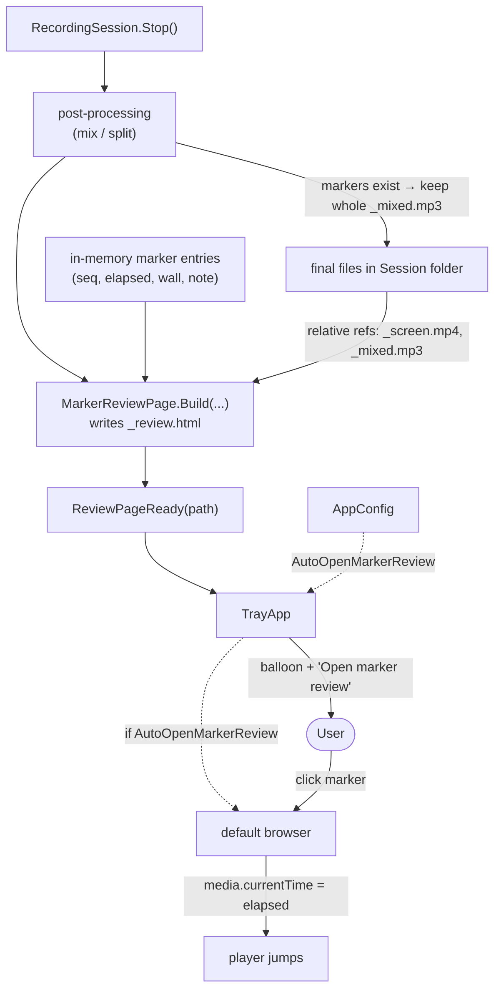
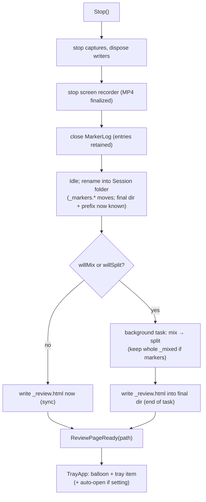

# Marker review page — design spec

Make Markers **navigable**: when a Recording Session has at least one Marker,
SPRecorder generates a self-contained **Marker review page** (`_review.html`) next to
the tracks. Open it in a browser, click a Marker, and the embedded player jumps to that
Marker's elapsed offset — in the Screen recording or the Mixed file. The page is an
*additive* artifact; the sidecar **Marker log** (`.md`/`.csv`) is unchanged and still
feeds NotebookLM.



**Decisions captured during grilling** (read first):
[ADR 0019](../../adr/0019-navigable-markers-via-generated-html-review-page.md) HTML review page (not in-app player / not chapter file) ·
[ADR 0020](../../adr/0020-review-page-scopes-to-screen-video-and-mixed-audio.md) scope = Screen video + Mixed audio only ·
[ADR 0021](../../adr/0021-keep-whole-mixed-file-when-markers-exist.md) keep whole Mixed file when markers exist ·
[ADR 0022](../../adr/0022-review-page-access-balloon-tray-and-optional-auto-open.md) access via balloon + tray, opt-in auto-open.

Confirmed UI: [docs/markers-review-mockup.html](../../markers-review-mockup.html) (interactive — click a marker, try Fullscreen).

---

## 1. Context & goal

Markers today are a text-only sidecar **Marker log** (see the
[markers spec](2026-06-25-markers-design.md) and ADR 0007): the user reads `00:12:34`
and scrubs their player by hand. This feature closes that gap. See
[CONTEXT.md](../../../CONTEXT.md) for **Marker**, **Marker log**, and the new **Marker
review page**.

**Goal:** after a marked recording, the user opens one `.html` file and clicks any
Marker to jump straight to that moment in the Screen recording or the Mixed file — no
manual scrubbing, no new player installed, works offline.

Every track of a Recording Session begins at the same `_startedAt`, so a Marker's
**elapsed offset** maps directly onto any continuous track via `media.currentTime`
(ADR 0007 "Consequence"). The review page relies on that: the Screen recording is always
continuous (ADR 0005), and the Mixed file is kept whole when markers exist (ADR 0021),
so a single `currentTime = elapsedSeconds` is always exact — no chunk stitching needed.

---

## 2. Inputs the generator needs

The page is built from data the session already has:

| Input | Source | Notes |
|---|---|---|
| Session label | session name (if named), else start timestamp | same title rule as `MarkerLog.FinalizeMarkdownTitle` |
| `startedAt` | `RecordingSession._startedAt` | for the title block |
| Marker entries | **new** in-memory list (§3.1) | `(seq, elapsedSeconds, wallClock, note)` per marker |
| Playable media | enumerate final files in the output dir | `_screen.mp4` (if it exists) and/or whole `_mixed.mp3` (if it exists) — by **relative** filename |
| Output path | `FileNameBuilder.BuildReviewPage` | `{prefix}_review.html` beside the tracks |

The page does **not** receive the media duration from C#; the browser reads
`media.duration` after `loadedmetadata` and positions the Marker ticks itself
(the mockup hard-codes a duration only because it has no real file).

---

## 3. Components

### 3.1 `MarkerLog` keeps its entries ([MarkerLog.cs](../../../src/SPRecorder/Recording/MarkerLog.cs))

`MarkerLog` already receives `(stamp, note)` and assigns the sequence in `Append`. Today
it discards them after writing the line. Accumulate them so the generator needs no file
re-parsing:

```csharp
public readonly record struct MarkerEntry(int Seq, TimeSpan Elapsed, DateTime WallClock, string? Note);

private readonly List<MarkerEntry> _entries = new();
public IReadOnlyList<MarkerEntry> Entries => _entries;
```

In `Append`, after `_count++`, add `_entries.Add(new MarkerEntry(_count, stamp.Elapsed, stamp.WallClock, note));`.
The list lives as long as the `MarkerLog` instance — which `RecordingSession` holds until
the next `Start()`, and the generator runs before then (§4). Purely additive; existing
line-writing and `FinalizeMarkdownTitle` are untouched.

### 3.2 `FileNameBuilder.BuildReviewPage` ([FileNameBuilder.cs](../../../src/SPRecorder/Recording/FileNameBuilder.cs))

Analogous to the existing `BuildMarker`/`BuildScreen`:

```csharp
public static string BuildReviewPage(string pattern, DateTime timestamp) // → "{prefix}_review.html"
```

`.html` extension; no collision with `_markers.md`/`.csv`. Unlike the live Marker log,
the page is **written directly to its final location** after post-processing (the Session
folder if the recording was named, else `OutputDirectory`), so it needs no move step (§4).

### 3.3 `MarkerReviewPage` (new, `Recording/MarkerReviewPage.cs`)

A pure, unit-testable HTML emitter — no I/O dependency beyond writing the final string.

```csharp
public sealed record ReviewMedia(string Kind, string RelativeFile); // Kind: "video" | "audio"

public static class MarkerReviewPage
{
    // Returns the complete HTML document as a string.
    public static string Render(string title, DateTime startedAt,
                                IReadOnlyList<MarkerEntry> markers,
                                IReadOnlyList<ReviewMedia> media);

    // Convenience: Render(...) then File.WriteAllText(path, html, UTF8).
    public static void Write(string path, string title, DateTime startedAt,
                             IReadOnlyList<MarkerEntry> markers,
                             IReadOnlyList<ReviewMedia> media);
}
```

- **Self-contained:** one HTML document with inline `<style>`/`<script>`. Media is
  referenced by **relative filename** (`<video src="..._screen.mp4">`), never embedded —
  tracks are tens-to-hundreds of MB (ADR 0019). The page must therefore sit beside the
  tracks and travel with the folder.
- **Marker data** is emitted as a JS array literal: `{seq, elapsed (seconds), wall, note}`.
- **Note escaping:** notes are arbitrary user text (Thai, quotes, `<`, `&`). HTML-escape
  for the list (`& < > "`), and JSON-encode for the JS array. A small `HtmlEscape` helper
  (mirrors the existing `CsvEscape` pattern) is unit-tested.
- **Layout & behavior** follow the confirmed mockup:
  - Title block (label + `startedAt` + marker count) — same wording as the Markdown log.
  - Track switcher: **Video (screen)** and/or **Mixed audio**, default = video if present
    else mixed (ADR 0020). Only renders tracks that exist; one track ⇒ no switcher.
  - Player wraps a native `<video>`/`<audio>` element driven by minimal custom controls
    (play/pause, scrub bar with **Marker ticks**, time readout). Ticks are positioned on
    `loadedmetadata` using `media.duration`.
  - **Marker list:** clickable rows (`#seq · elapsed`, muted wall-clock, note). Click ⇒
    `media.currentTime = elapsedSeconds`; the active row + its tick highlight.
  - **⛶ Fullscreen button:** calls `requestFullscreen()` on the whole review container
    (player **and** marker list), so Markers stay clickable while enlarged — this is the
    "make the video bigger" affordance. (Minor UI choice, no ADR.)

```mermaid
sequenceDiagram
    actor U as User
    participant P as Marker review page (browser)
    participant M as &lt;video&gt;/&lt;audio&gt;
    U->>P: open _review.html
    P->>M: load (relative src)
    M-->>P: loadedmetadata (duration)
    P->>P: position marker ticks
    U->>P: click marker #2
    P->>M: currentTime = 1510s
    M-->>U: playback jumps to 00:25:10
    U->>P: click ⛶ Fullscreen
    P->>P: requestFullscreen(review container)
```

---

## 4. Integration into `RecordingSession` ([RecordingSession.cs](../../../src/SPRecorder/Recording/RecordingSession.cs))

### 4.1 Keep the whole Mixed file when markers exist (ADR 0021)

In `SplitTrack`, the Mixed-track call must **not** delete the whole `_mixed.mp3` when the
session has markers. Smallest change: pass a "preserve original" flag for the mixed path
only (System/Mic keep deleting):

```csharp
// in the post-processing task (count lives on MarkerLog.Count):
bool keepMixedWhole = _markerLog is { Count: > 0 };   // markers → review page needs continuous audio
if (cfg.SplitMixedTrack && finalMixedPath is not null)
    totalChunks += SplitTrack(splitter, finalMixedPath, cfg, preserveOriginal: keepMixedWhole);
```

`SplitTrack(..., bool preserveOriginal = false)` skips `File.Delete(path)` when
`preserveOriginal` is true (chunks are still produced for upload). No other track changes.

### 4.2 Generation timing

The page needs the **final** file set, so it is generated after post-processing:



- **Guard:** generate only when `_markerLog.Count > 0` **and** at least one playable track
  exists (`_screen.mp4` and/or whole `_mixed.mp3`). Otherwise skip — the Marker log
  still stands (§6).
- Capture the marker entries and the resolved media list into locals before the
  background task (same way `sysPath`/`mixedPath` are captured today), so a subsequent
  `Start()` cannot race the generation.
- **New event** (additive): `public event Action<string>? ReviewPageReady;` — arg is the
  final review-page path. Fired once, after the page is written.

---

## 5. UI surfaces

### 5.1 The generated page
Per §3.3 and the confirmed mockup.

### 5.2 `TrayApp` ([TrayApp.cs](../../../src/SPRecorder/Tray/TrayApp.cs))
- Subscribe to `ReviewPageReady`: store the path in `_lastReviewPagePath`; show a
  **clickable balloon** ("Marker review ready — Q2 Planning · N markers"); if
  `AutoOpenMarkerReview`, launch it (`Process.Start` with `UseShellExecute = true`).
- Balloon click and a new tray menu item **"Open marker review"** both open
  `_lastReviewPagePath` (via `Process.Start` with `UseShellExecute = true`, like the
  existing `OpenFolder`). The item is enabled only while `_lastReviewPagePath` exists.
  Placed near the existing "Open recordings folder" item.
- Reuse the existing `ShowBalloon`/`OnUi` helpers; no sound (consistent with ADR 0011).

### 5.3 Settings — Markers tab ([SettingsForm.cs](../../../src/SPRecorder/Settings/SettingsForm.cs))
Add one checkbox to the existing Markers tab: **"Open review page in browser when
recording stops"** bound to `AutoOpenMarkerReview`. No other Settings changes.

### 5.4 `AppConfig` ([AppConfig.cs](../../../src/SPRecorder/Configuration/AppConfig.cs))
| Field | Type | Default | Notes |
|---|---|---|---|
| `AutoOpenMarkerReview` | `bool` | `false` | opt-in auto-open (ADR 0022) |

Add the key to [appsettings.json](../../../src/SPRecorder/appsettings.json). No special
`Load` normalization needed (a bool binds directly).

---

## 6. Edge cases & failure modes

| # | Case | Behavior |
|---|---|---|
| 1 | Session has 0 markers | No page generated; no balloon/tray item (lazy, mirrors the log). |
| 2 | Markers exist, screen recorded | Page defaults to video; if Mixed also exists, switcher offers it. |
| 3 | Markers exist, audio-only (no screen), Mixed on | Page plays the whole `_mixed.mp3`; no switcher. |
| 4 | Markers exist, split on | Whole `_mixed.mp3` kept (ADR 0021) → exact jump; chunks still produced for upload. |
| 5 | Markers exist but **no playable track** (Mixed disabled **and** no screen) | Skip page generation; Marker log remains. (System/Mic stay unexposed — ADR 0020.) |
| 6 | Note contains `<`, `&`, `"`, or Thai text | HTML-escaped in the list, JSON-encoded in the JS array; renders verbatim. |
| 7 | Browser cannot decode the codec | Out of our control; H.264+AAC MP4 and MP3 play in Chrome/Edge (the Windows default). Noted as a dependency. |
| 8 | Whole folder moved/copied elsewhere | Relative refs keep working (page travels with the tracks). Renaming an individual track file breaks its link — accepted, same as any sidecar. |
| 9 | Page write fails (disk/IO) | Caught; routed to the existing `Warning` event; recording/post-processing not torn down (mirrors `SplitTrack`). |
| 10 | New recording starts during post-processing | Marker entries + media list were captured into locals (§4.2); new session uses a new timestamp — no collision. |
| 11 | `Process.Start` (auto-open) fails | Caught + `Warning`; the balloon/tray item still let the user open it manually. |

---

## 7. Non-goals

- **No media embedded in the HTML** — referenced by relative path only (ADR 0019).
- **No in-app C# player** (ADR 0019); **no external chapter/bookmark files** and nothing
  embedded into the tracks — ADR 0007 stands.
- **No System/Mic** in the page (ADR 0020).
- **No per-chunk timeline / stitching** — relies on the kept whole Mixed file (ADR 0021).
- **The page does not replace the Marker log** — the `.md`/`.csv` is still produced and is
  what gets pasted into NotebookLM.
- **No editing markers** in the page; it is read-only, like the log.
- **No transcript, waveform, or thumbnails**; no web server — a plain local file.

---

## 8. Testing notes

Pure / unit-testable (the project already unit-tests `MarkerLog`, `FileNameBuilder`, etc.):

- `MarkerReviewPage.Render` → output contains each marker's seq/elapsed/note; emits the JS
  data array with elapsed in **seconds**; references exactly the media files passed in.
- `HtmlEscape` helper → escapes `& < > "`; passes plain text through; handles Thai/quotes.
- Media-selection mapping: given which files exist → correct `ReviewMedia` set
  (video+audio / video-only / audio-only / none ⇒ no page).
- `FileNameBuilder.BuildReviewPage` → correct `{prefix}_review.html`.
- `MarkerLog.Entries` → accumulates one entry per `Append`, with seq/elapsed/wall/note.
- `SplitTrack(preserveOriginal: true)` → produces chunks **and** keeps the original;
  `preserveOriginal: false` → deletes it (existing behavior, regression-guarded).

Manual / integration:

- Record with markers + screen → balloon appears; page opens; clicking a marker jumps the
  video; **⛶ Fullscreen** enlarges the page and markers still jump; switch to Mixed audio.
- Audio-only + markers → page plays Mixed; jump exact.
- Split on + markers → whole `_mixed.mp3` present alongside chunks; page jumps correctly.
- Note with quotes / Thai / `<` renders correctly.
- `AutoOpenMarkerReview` on → browser opens automatically; off → only balloon + tray item.
- Tray "Open marker review" opens the last session's page; disabled when there is none.

---

## 9. Resolved questions

- Page generated **lazily** — only when a session has ≥ 1 marker and a playable track.
- File name `{prefix}_review.html`, sibling to `{prefix}_markers.*`, moved into the
  Session folder with the other tracks.
- Default track = video if present, else Mixed; switcher only when both exist.
- `AutoOpenMarkerReview` default **false**.
- Generated **after** post-processing so it sees the final file set.
- Fullscreen = `requestFullscreen()` on the whole review container (player + markers).
- The browser, not C#, owns playback and reads `media.duration`.
